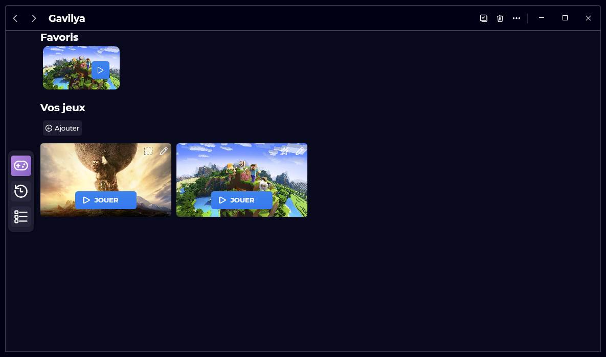
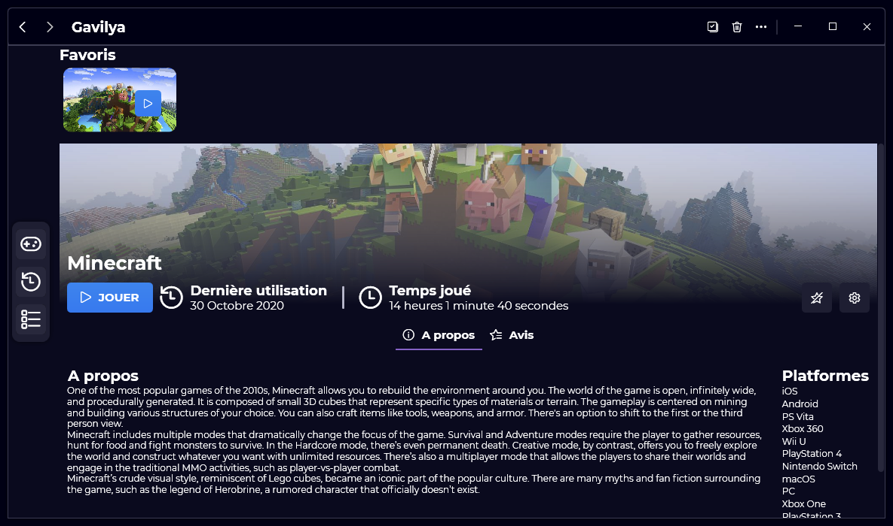
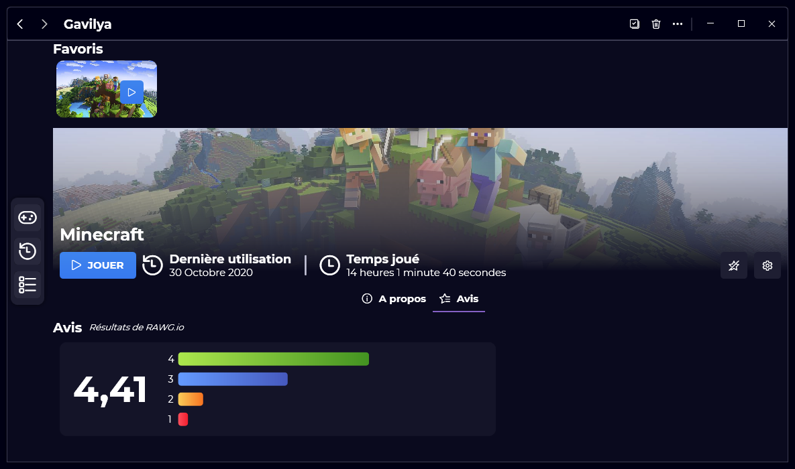

A new version of Gavilya is now available, and it's the version 1.2.0.2102.

## Changelog
### New
- Redesigned the "GameInfoPage" (#50)
- Added a "review" section in the "GameInfoPage" (#51)
- Added more tooltips (#51)
- Gavilya is now using modern message boxes (#52)
### Fixed
- Fixed issues with the new UI (#50)
- Fixed an issue with the minimum size of the Main window
- Fixed issues with DPI scale (#53)
### Updated
- Updated LeoCorpLibrary
- Updated System.Drawing.Common
- Updated Setup
- Updated Xalyus Updater
- Updated to the new dark mode colors (#55)
- Updated the Main Windows default size
- Updated the Splash Screen (#55)

## Links
- [GitHub](https://github.com/Leo-Corporation/Gavilya)
- [Download](https://bit.ly/Gavilya)

## Screenshots

