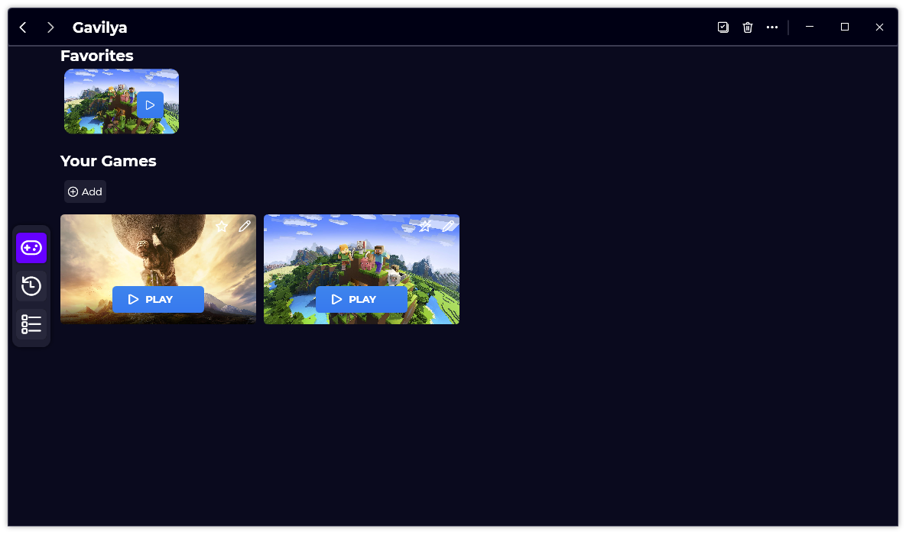
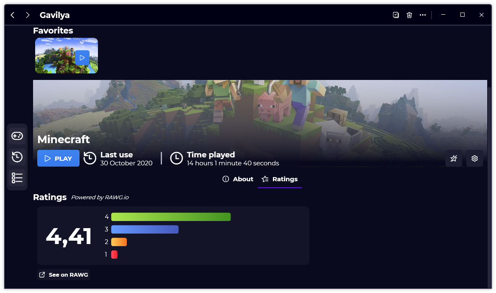
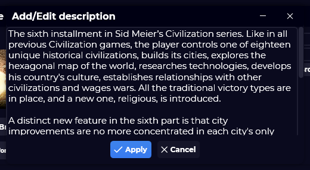
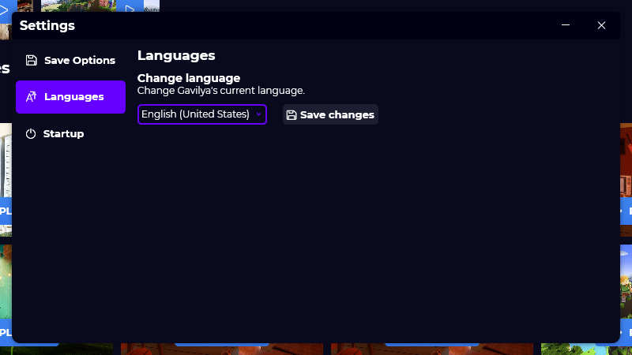

A new version of Gavilya is now available, and it's the version 1.3.0.2103.

## Changelog
### New
- Changed the accent color (#58)
- Added a Beta version system
- Added new ComboBoxes (#59)
- Added a new logo (#60)
- Added more detailed tooltips in the "Ratings" tag (#61)
- Added a link to RAWG.io in the "Ratings" tab (#61)
- Gavilya is now avoiding crashes by using try/catch (#70)
### Fixed
- Fixed: A delete confirmation message appears when no games are selected (#68)
### Updated
- Updated System.Drawing.Common
- Updated LeoCorpLibrary
- Updated RAWG API Key (#62)
- Updated Setup
- Improved the design of the "Description" field of "Add" and "Edit" games windows (#63)
- Updated styles
- Updated translations

## Download
[Click here](https://bit.ly/Gavilya) to download Gavilya.

## Screenshots

