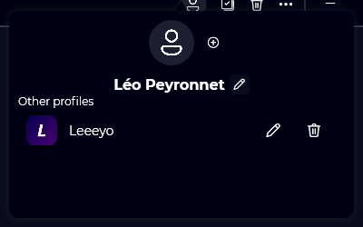
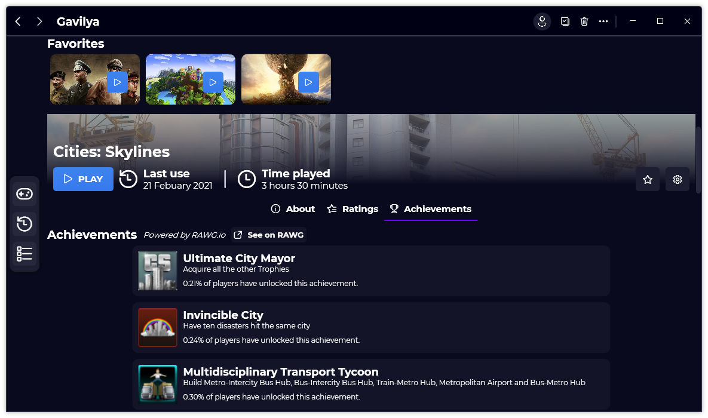
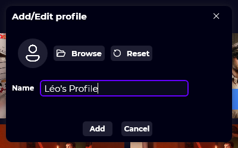

 A new version of Gavilya is now available, and it’s the version 1.4.0.2104.

## Changelog
### New
- Added padding to TextBoxes (#77)
- Added the possibility to view a game's achievements (#78)
- Added a link to RAWG.io from "Achievements" tab (#78)
- Added the profile management system (#79)
- Added the profile button (#79)
- Added rounded corners on achievements (#78)
- Added a popup menu that displays profiles (#79)
- Added the possibility to add and edit a profile (#79)
- Added the possibility to delete a profile (#79)
- Added tooltips (#79)
- Added a confirm message before deleting a profile (#79)
- Added the possibility to switch profiles (#79)
- Added a placeholder when there isn't any profiles (#79)
- Added a placeholder when there isn't any achievements (#78)
- Added the possibility to reset the profile picture (#79)
### Fixed
- Fixed: First run window still uses old colors (#73)
- Fixed: In the "Game info" page, when launching a game, the "Last use" text is repeated (#74)
- Fixed: The "Search a game cover" window doesn't have a Title (#75)
- Fixed: When launching a game from a favorite card, the "Game info" page should be updated (#76)
- Fixed issues with the TextBox in the Description window (#77)
- Fixed translations
- Fixed UI issues
- Fixed: The current profile is no longer showing in the "Other profiles" section (#79)
- Fixed issues with events (#79)
- Fixed: When resetting the picture of a profile, the profile picture isn't updated (#81)
### Updated
- Updated Gavilya.SDK (#78)
- Updated LeoCorpLibrary
- Updated Setup
- The default profile is now using the username as a name (#79)

## Download

[Click here](https://bit.ly/Gavilya) to download Gavilya.

## Screenshots

