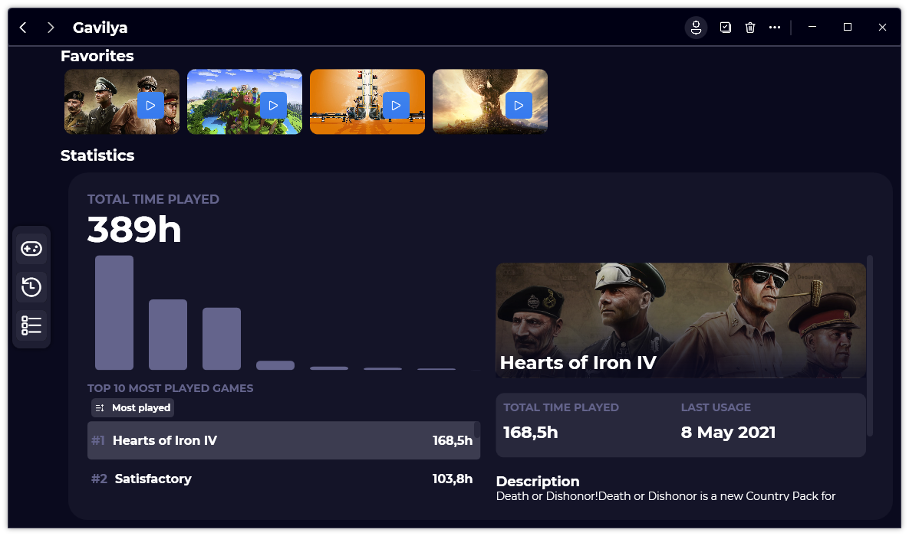
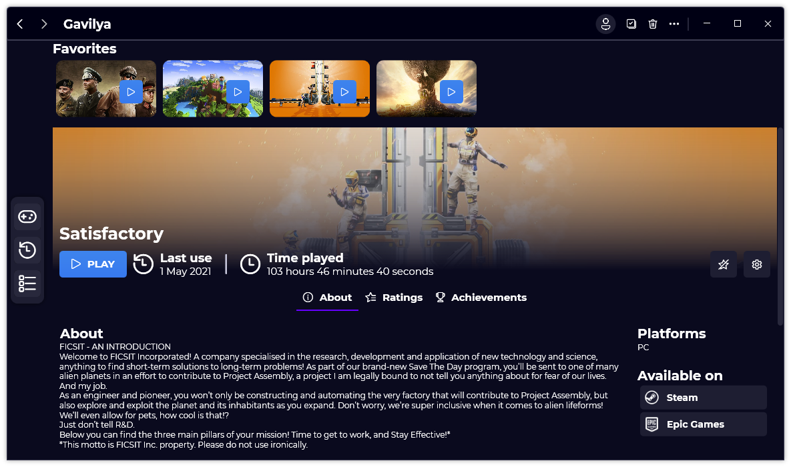

A new version is available for Gavilya, and it is the version 1.5.0.2105.

## Changelog
### New
- Added "Statistics" page (#84)
- Added a bar chart showing the top ten most played games time (from lower to higher)
- Added a complete list of all the user games from the most played to the least
- Added a link to the "Statistics" page (#85)
- Added a position indicator in the top 10 most played games (#84)
- Added the possibility to select a game stat card (#84)
- Added a card recapitulating a game informations (#84)
- Added an option allowing the user to change the order of the most played games (#84)
- Added the "stores" section in "GameInfo" page (#86)
- Added the possibility to associate stores with a game (#86)
### Fixed
- Fixed color consistency (#84)
- Fixed: The Statistics info card is now responsive (#84)
- Fixed scroll bars issues (#84)
### Updated
- Updated LeoCorpLibrary
- Improved card design (#84)

## Download

[Click here](https://bit.ly/Gavilya) to download Gavilya.

## Screenshots

