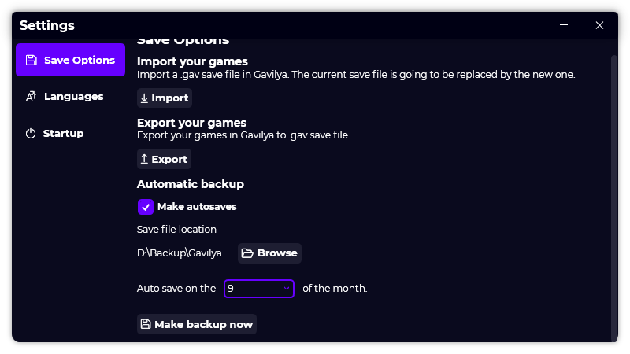

A new version of Gavilya is now available and it is the version 1.6.0.2106.

## Changelog
### New
- Added platform assets (#98)
- Added a new platform UI (#98)
- Added the "AutoSave" UI in settings (#99)
- Added scroll bars in settings (#99)
- Added the possibility to set settings of autosaves (#99)
- Added the possibility to make automatic backup of games (#99)
- Added the possibility to add the current profile name when exporting games (#100)
### Fixed
- Fixed issues in checkbox design (#99)
- The dropdown's selected item is now matching with settings (#99)
### Updated
- Updated LeoCorpLibrary
- Updated assets of "First run" and more (#97)

## Download

[Click here](https://bit.ly/Gavilya) to download Gavilya.

## Screenshot

