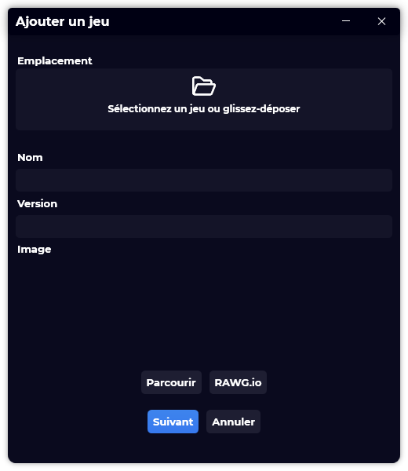

A new version of Gavilya is available, and it is the version 1.7.0.2107.

## Changelog
### New
- Added translations
- Added a placeholder in "GameInfoPage" when there is no ratings (#109)
- Added the possibility to select games when importing games on first run (#110)
- Added a new import games experience on first run (#110)
- Added an indicator when the game can't be imported (#110)
- Added a new import games experience in settings (#110)
- Added a new Add experience (#111)
- Added a new Edit experience (#111)
- Added a notification when updates are available (#112)
- Added the possibility to go back when adding/editing a game (#111)
### Fixed
- Fixed: In "Settings", the text is not displaying properly (#108)
- Fixed an issue with Game Properties window
- Fixed an issue where you could add game without any informations
- Fixed: When importing a game without an image cover, it is considered as invalid (#115)
### Updated
- Updated LeoCorpLibrary
- Improved buttons alignment

## Download

[Click here](https://bit.ly/Gavilya) to download Gavilya.

## Screenshot
