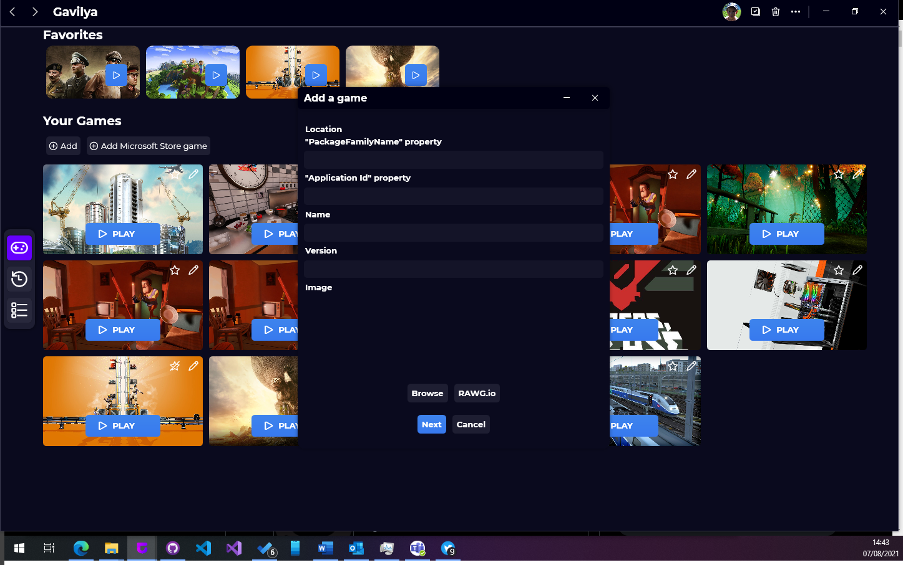

A new version of Gavilya is available and it is the version 1.8.0.2108.

## Changelog
### New
- Added the possibility to always check if a game is running (#122)
- Added the possibility to add UWP games (#123)
- Added the possibility to edit UWP games (#123)
- Added the possibility to launch UWP games (#123)
- Added translations
### Fixed
- Fixed an issue when no image is specified with UWP games
- Fixed: The "Properties" window is not displaying properly (#124)
- Fixed: "Select game(s)" button is bugged when used on another page than the "Cards" page (#125)
### Updated
- Updated LeoCorpLibrary
- Updated "UWP" to "Microsoft Store"

## Download

[Click here](https://bit.ly/Gavilya) to download Gavilya.

## Screenshot

