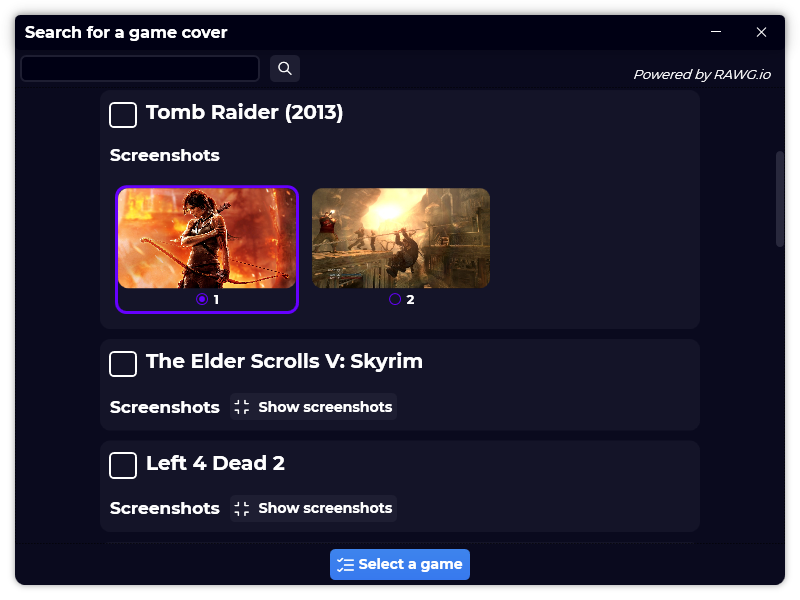

A new version of Gavilya is now available, and it is the version 1.9.0.2109.

## Changelog
### New
- Added the possibility to view two screenshots in "Search game cover" (#133)
- Added custom radio button styles (#133)
- Added the possibility to select a screenshot in "Search game cover" (#133)
- Added translations
- Added the possibility to launch Steam games via Steam URI (#134)
- Redesigned "Startup page" section in Settings (#135)
- Added in "About" window a license list (#136)
### Fixed
- Fixed: "Add Microsoft Store game" button visible on non-Windows 10 devices (#132)
### Updated
- Updated LeoCorpLibrary
- Updated the size of the "Search game cover" window (#133)
- Updated "Select game" button's style (#133)

## Download

[Click here](https://bit.ly/Gavilya) to download Gavilya.

## Screenshot

