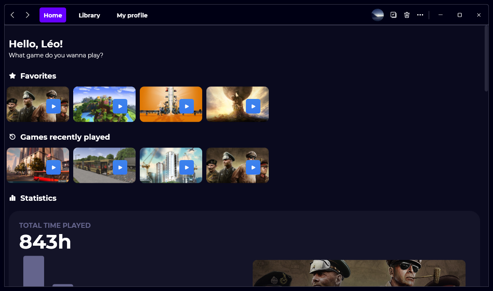

The next major version of Gavilya is finally here. Version 2.0 brings lots of changes, so let’s see what’s new!

## New Home page

Gavilya version 2.0 brings a brand-new home page, where you can quickly find your favorites, your games that you’ve played recently, and your statistics. This means that the “Statistics” page is now in the home page. You’ll notice that the sidebar has been removed, and there is now a navigation bar in the title bar of the window.

## New Library page

In this new version, you can find all your games in the “Library” page. In this page, you can still choose between “Cards mode”, “Recently played games” and “List mode”.

## New Profile page

You can now see information about your profile in the new “Profile” page. You can see your top 3 most played games and your favorites. You can also edit your profile from this page.

## Huge performance improvements

Version 2.0 brings huge performance improvements: Gavilya will now use less RAM than before. Here’s the difference between version 1.9 and version 2.0:

| | Version 1.9 | Version 2.0 |
| :--: | :---------: | :---------: |
| RAM usage | ~454 MB | ~87.3 MB |
| CPU usage | ~12.8% | ~11.6% |

_Tests were made on an Intel Core i5 11600K with 32GB of RAM, running on Windows 10 21H1 with 17 games._

## Ready for Windows 11

Gavilya version 2.0 is ready for Windows 11! You will notice that Gavilya is using new Fluent icons everywhere. This version is also the first version of Gavilya that has been tested on Windows 11.

## Download

[Click here](https://bit.ly/Gavilya) to download Gavilya