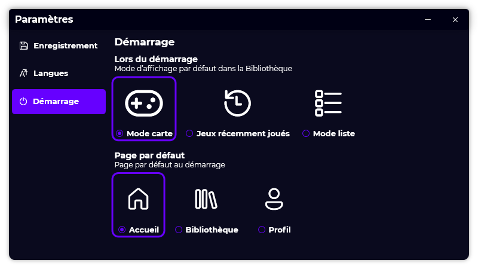

A new version of Gavilya is now available, and it is the version 2.1.0.2111.

## Changelog
### New
- Added a "Play" button in "List mode" (#161)
- Added a "Play" button in "List mode" when hovering a Game Item (#161)
- Added the possibility to add games from any view mode (#162)
- Added translations (#163)
- Added the possibility to set the default page on startup (#163)
- Redesigned the "Profile" page "Spotlight" section (#164)
- Added more infos in "Favorite" section "Profile" page (#165)
- Added rounded corners to "Favorite" section in "Profile" page (#168)
### Fixed
- Fixed: "Popup menu" window doesn't have a name (#159)
- Fixed: When providing a custom process name for an UWP game, total time played isn't counted (#160)
- Fixed an issue with UWP and Steam games not launching
- Fixed an issue when there is no games in "Profile" page
### Updated
- Updated LeoCorpLibrary
- Updated RestSharp
- Updated System.Drawing.Common

## Download

[Click here](https://bit.ly/Gavilya) to download Gavilya.

## Screenshot
