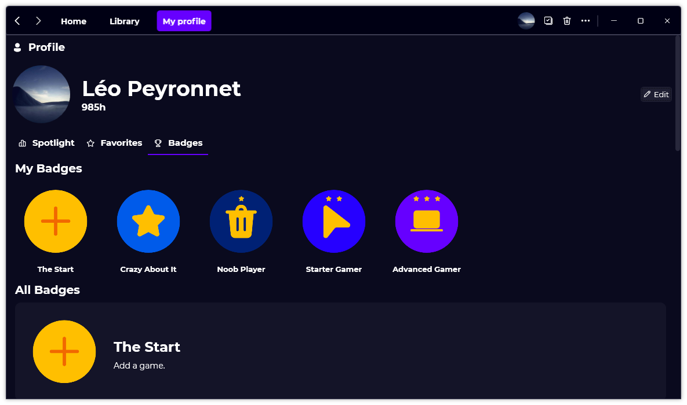

A new version of Gavilya is now available, and it is the version 2.2.0.2112.

## Changelog
### New
- Added the possibility to launch favorite games from a taskbar jump list (#179)
- Added translations
- Added the possibility to launch a specific page from a taskbar jump list (#180)
- Added "Data" settings page (#181)
- Added the possibility to reset settings (#181)
- Added Badges information (#182)
- Added Badges assets (#182)
- Added badges in "Profile" page (#182)
- Added tooltips on Badges (#182)
- Added "All Badges" section in "Profile" page (#182)
### Fixed
- Fixed: When updating favorites, the profile page content doesn't change (#177)
- Fixed: When removing a game, the profile page isn't updated (#178)
- Fixed issues when resizing the window
- When a badge is no longer valid, it won't be visible in the "Profile" page
- Fixed issues when the user has no badges
- Fixed crash issues with "Profile" page
### Updated
- Updated LeoCorpLibrary
- Updated code for LeoCorpLibrary 4.1 (#174)
- Updated RestSharp
- The jumplist now uses the executable's icon (#179)

## Download

[Click here](https://bit.ly/Gavilya) to download Gavilya.

## Website

Did you know that Gavilya has a website? Check it out [here](https://gavilya.leocorporation.dev/).

## Screenshot
