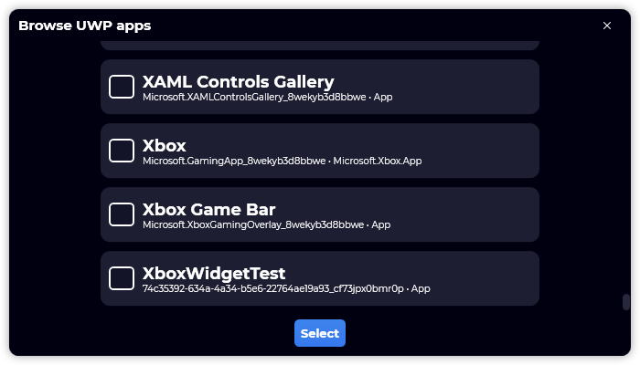

A new version of Gavilya is now available, and it is the version 2.3.0.2201.

## Changelog
### New
- Refactored code for C# 10
- Removed legacy code
- Added translations
- Added the possibility to convert a regular game to a Steam game (#194)
- Added the "Browse UWP apps" button (#195)
- Added "UwpApp" record to Gavilya.SDK (#195)
- Added the possibility to get UWP apps from a PowerShell script (#195)
- Added "Uwp App" item (#195)
- Added the possibility to auto detect UWP applications (#195)
- The name of the UWP game is now also automatically detected (#195)
- Improved margins of "UwpApp" item (#195)
### Fixed
- UWP apps are now sorted alphabetically (#195)
- Fixed compatibility issues with RestSharp
- Fixed an issue with the SDK
- Fixed an issue with the "dot" in "UwpApp" item
- Fixed an issue when multiple UWP apps are selected
- Fixed an alignment issue with a button
### Updated
- Updated LeoCorpLibrary
- Updated RestSharp
- Updated Splash screen (#192)
- Upgraded to .NET 6 (#193)
- Updated Setup
- Upgraded Gavilya.SDK to .NET 6
- Updated Gavilya.SDK library

## Download

[Click here](https://bit.ly/Gavilya) to download Gavilya.

## Website

[Click here](https://gavilya.leocorporation.dev/) to go to the website of Gavilya.

## Screenshot
