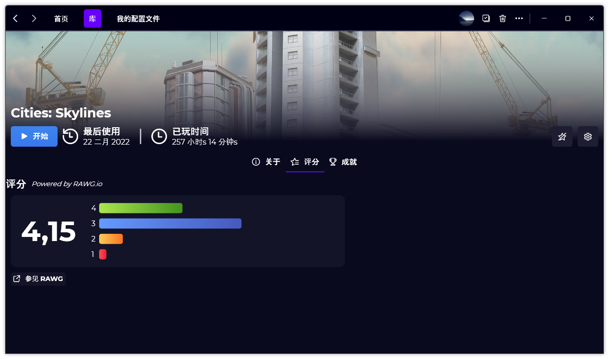

A new version of Gavilya is now available, and it is the version 2.3.1.0.2202. Note that this version is smaller than usual and doesn’t include any new features, but only fixes, improvements, and new translations.

## Changelog
### New
- Added Simplified Chinese (#201) (Thanks to @wcxu21)
### Fixed
- Performance optimizations
### Updated
- Updated LeoCorpLibrary
- Updated RestSharp
- Upgraded Xalyus Updater to .NET 6 (#193)
- Updated Setup

## Download

[Click here](https://bit.ly/Gavilya) to download Gavilya

## Website

Gavilya has a website! [Click here to learn more about it.](https://gavilya.leocorporation.dev/)

## Screenshot
