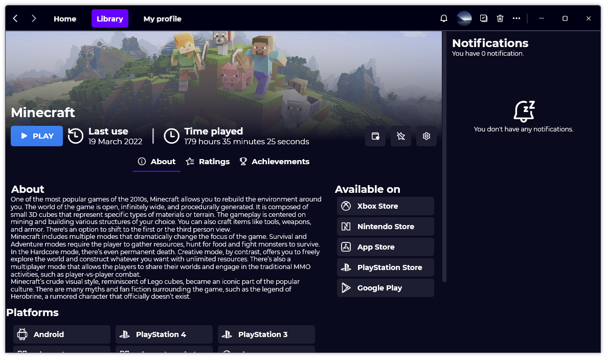

A new version of Gavilya is now available and it is the version 2.4.0.2203.

## Changelog
### New
- Added translations (#211)
- Added "Home Options" page (#211)
- Added the possibility to go to "Home Options" (#211)
- Added the possibility to set the maximum number of recent games to show in Home (#211)
- Added a "Recommended Games" section in Home (#212)
- Added a placeholder when there aren't any recommended games (#212)
- Added a menu on game card (#213)
- Added the possibility to launch a game as admin (#213)
- Added an "Admin" button in "Game info" page (#213)
- Added a message when trying to launch UWP apps as admin (#213)
- Added notification panel (#214)
- Added notification item (#214)
- Added a notification center (#214)
- Added a badge on notification icon (#214)
### Updated
- Updated LeoCorpLibrary

## Download

[Click here](https://bit.ly/Gavilya) to download Gavilya.

## Screenshot
