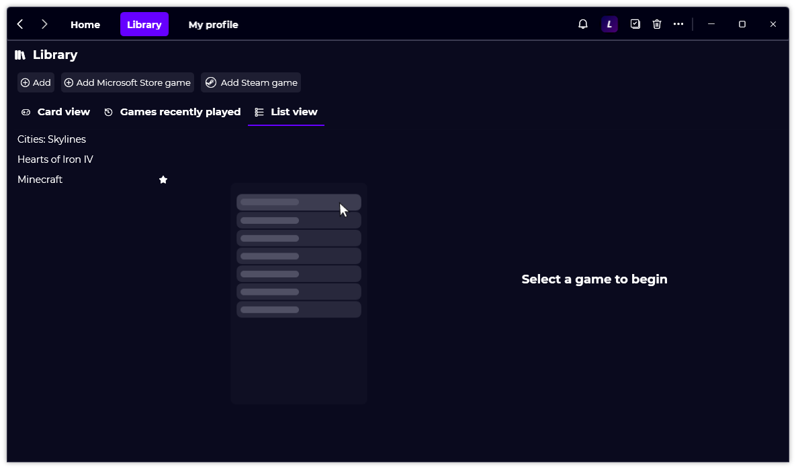

A new version of Gavilya is now available, and it is the version 2.5.0.2205.

## Changelog
### New
- Added a colorful border to the game cards if it's a favorite (#223)
- Added a star icon to games marked as favorite in "List" mode (#224)
- Added translations (#225)
- Added a notification if the user hasn't played a game for a long time (#225)
- Added action when clicking "Show" button (#225)
- Added a message if Steam isn't running (#226)
### Fixed
- Fixed: Some games may be not responding after hitting play (#222)
### Updated
- Removed unnecessary RAWG API fetch
- Removed obsolete WebClient code
- Updated LeoCorpLibrary

## Website

[Click here](https://gavilya.leocorporation.dev/) to go to the website of Gavilya.

## Download

[Click here](https://bit.ly/Gavilya) to download Gavilya.

## Screenshot
