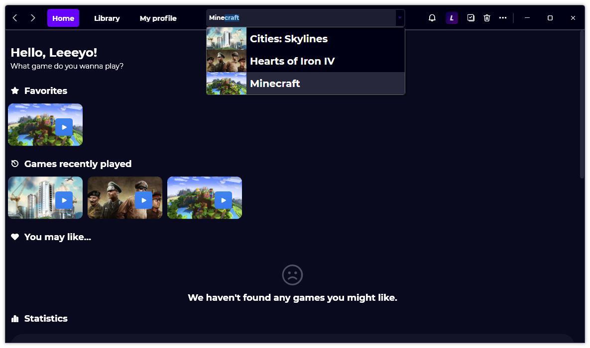

A new version of Gavilya is now available and it is the version 2.6.0.2206.

## Changelog
### New
- Added translations (#236)
- Added a link to the GitHub repository (#236)
- Added error message localized string (#237)
- Added an error message if the user isn't logged on Steam (#237) (Thanks to @sgamesdev)
- Added translations (#238)
- Added an option to display unused games in Settings (#238)
- Added the possibility to display unused games in "You may like" section (#238)
- Added a message when updating the language in Settings (#239)
- Added "Search" item (#240)
- Added a search bar (#240)
- Search box shows results when typing text (#240)
- Added rounded corners to search box (#240)
- Added the possibility to see details of a game from the search bar (#240)
- Added maximum width to search box (#240)
- Added key shortcuts to the search box (#240)
### Fixed
- Fixed an issue with the search function (#240)
- Fixed: The search box is using too much RAM (#240)
- Fixed image misalignment in "Search" item (#240)
- Fixed an issue when removing a game
### Updated
- Updated LeoCorpLibrary
- Updated RestSharp
- Improved Search box design (#240)
- Updated Simplified Chinese translation (Thanks to @wcxu21)

## Website

[Check out Gavilya’s website](https://gavilya.leocorporation.dev/).

## Download

[Click here](https://bit.ly/Gavilya) to download Gavilya.

## Screenshot
