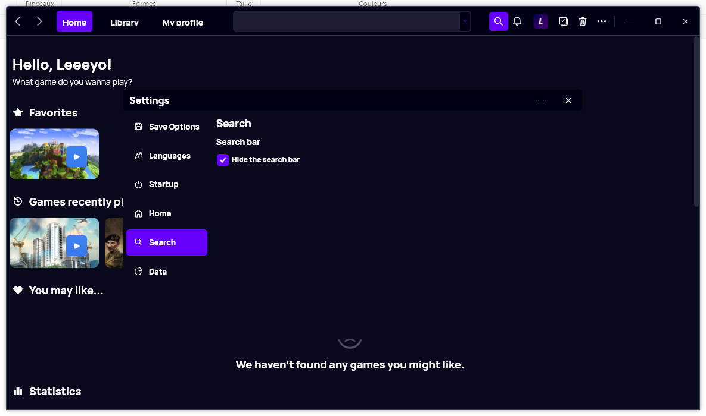

A new version of Gavilya is now available, and it is the version 2.7.0.2207.

## Changelog
### New
- Reduced the size of the search drop down (#254)
- Added translations (#255)
- Added "Search" settings page (#255)
- Added "Search" section in Settings (#255)
- Added the possibility to hide the search bar (#255)
- Added Search toggle button (#255)
- Added the number of games in "Profile" page (#256)
- Added tooltips in "Spotlight" section of "Profile" page (#257)
- Added font files (#259)

### Fixed
- Fixed: Achievements was null error (#249)
- Fixed issues when resizing the window (#253)
- Fixed issues when updating Settings (#255)
- Fixed issues with the new font (#259)

### Updated
- Updated LeoCorpLibrary
- Replaced gradient with solid color
- Removed unnecessary code (#255)
- Updated font (#259)

## Download

[Click here](https://bit.ly/Gavilya) to download Gavilya.

## Website

[Click here](https://gavilya.leocorporation.dev/) to see the website of Gavilya.

## Screenshot
