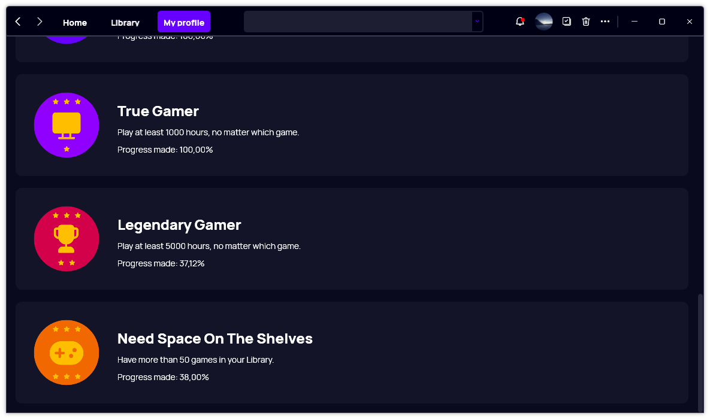

A new version of Gavilya is now available, and it is the version 2.8.0.2208.

## Changelog

### New

- Added translations (#268)
- Added "Results" section in Settings > Search (#268)
- Added the possibility to set the number of search results (#268)
- Added a progress label next to each badge (#269)

### Fixed

- Fixed: An item with the same key has already been added error (#264)
- Fixed: It's impossible to convert a game to a Steam game (#266)
- Fixed: The "Add" window is "cropped" (#267)
- Updating the number of search results no longer requires a restart (#268)

### Updated

- Updated LeoCorpLibrary
- The apply button in Settings > Language is no longer visible by default (#270)

## Download

[Click here]() to download Gavilya.

## Website

[Click here](https://gavilya.leocorporation.dev/) to go the website of Gavilya.

## Screenshot

