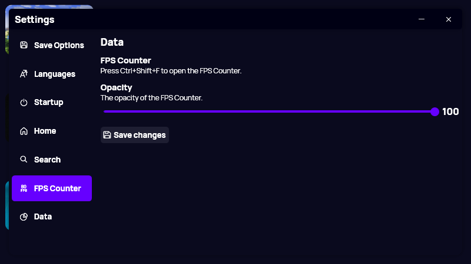

A new version of Gavilya is now available, and it is the version 2.9.0.2209.

## Changelog
### New
- Added FPS Counter (#278) (From [DareathX](https://github.com/DareathX) / [CustomFpsCounter](https://github.com/DareathX/CustomFpsCounter)) (Press Ctrl+Shift+F to toggle)
- Added the possibility to show/hide the FPS Counter (#279)
- Added translations (#280)
- Added "FPS" settings page (#280)
- Added slider styles (#280)
- Added the possibility to set the opacity of the FPS Counter (#280)

### Fixed
- Fixed an issue when selecting a cover
- Fixed topmost issues
- The "Opacity" slider only accepts integers (#280)
- Fixed issue with counter not working

### Updated
- Updated API Key
- Made the app smoother when exiting it (#281)

## FPS Counter
We've added an FPS Counter. To toggle it, press Ctrl+Shift+F. Note that not all games are supported, and that the frame rate might not be totally accurate, as it is showing the average FPS (not 100% real time).

## Download

[Click here](https://bit.ly/Gavilya) to download Gavilya.

## Website

[Click here](https://gavilya.leocorporation.dev/) to go the website of Gavilya.

## Screenshot

