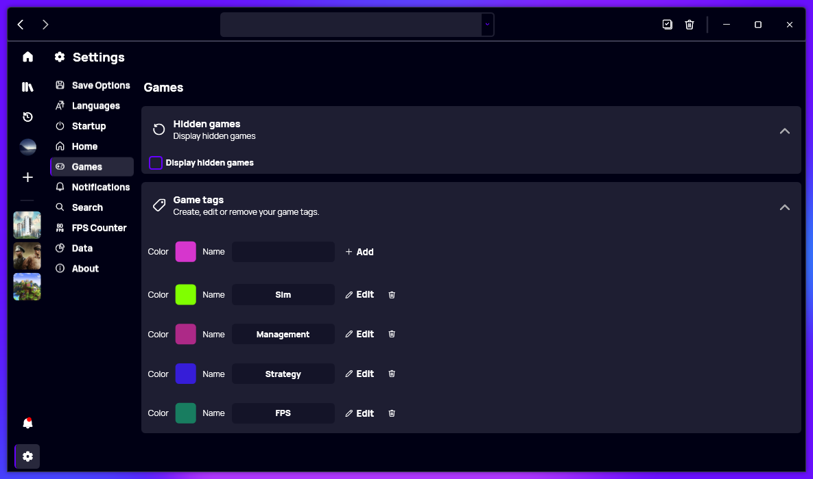

A new version of Gavilya is now available, and it is the version 3.1.0.2212.

### New
- Added GameTag class (#320)
- Added translations (#320)
- Added the possibility to create and edit tags (#320)
- Added the possibility to delete a tag (#320)
- Added the possibility to choose a random tag color (#320)
- Added the possibility to associate tags to games (#320)
- Added "Tags" feature (#320)
- Added Tags on GameCards (#320)
- Display favorites games at the top in "List" view (#321)
- Added translations (#322)
- Added the possibility to hide games (#322)
- Added an option in settings to show hidden games (#322)

### Fixed
- Fixed an issue when reloading the tag UI (#320)
- Fixed some issues when editing tags (#320)
- Fixed an issue when editing assigned tags (#320)
- Fixed a glitch with the "Add/Edit" window
- Fixed an issue when adding a game

### Updated
- Update Simplified Chinese Translation 
- Updated PeyrSharp.Env
- Updated PeyrSharp.Core
- Updated RestSharp
- Improved margin and alignment in Tag item (#320)
- The "Tags" section auto-hides if there are none
- Improved translations
- Updated the layout of the "Game Info" page (#323)
- Updated the margin of the tag item (#320)

## Download

[Click here](https://bit.ly/Gavilya) to download Gavilya.

## Website

[Click here](https://gavilya.leocorporation.dev/) to go the website of Gavilya.

## Screenshot

