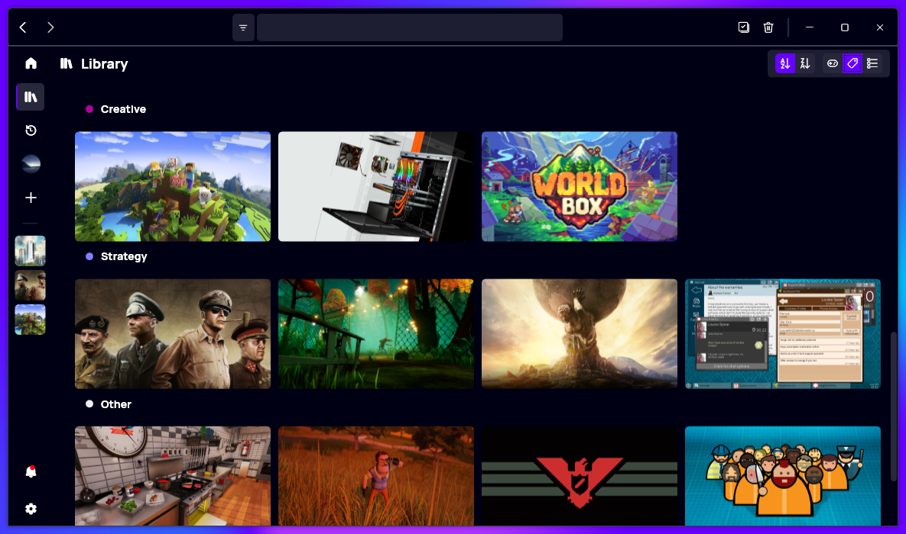

A new version of Gavilya is now available, and it is the version 3.2.0.2301.

## Changelog
### New
- Added TagCategory item (#333)
- Added "Tags" page (#333)
- Added the possibility to navigate to the "Tags" page (#333)
- Improved design when there are no games (#333)
- Added redirection for Steam games (#334)
- Redesigned search box (#335)
- Added translations (#335)
- Added the possibility to filter search results (#335)

### Fixed
- The Tags page now updates properly when changes are made (#333)

### Updated
- Updated PeyrSharp.Core (#331)
- Updated PeyrSharp.Env (#332)
- Updated copyright
- Updated Setup

## Download

[Click here](https://bit.ly/Gavilya) to download Gavilya.

## Website

[Click here](https://gavilya.leocorporation.dev/) to go the website of Gavilya.

## Screenshot

