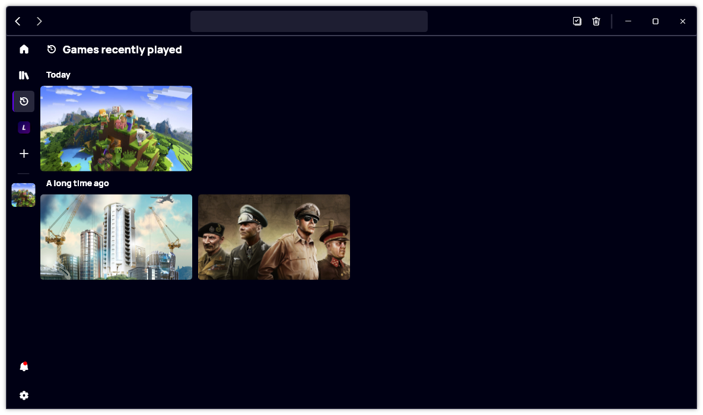

A new version of Gavilya is now available, and it is the version 3.3.0.2303.

## Changelog
### New
- Added translations (#348)
- Added the possibility to choose a game randomly on Home (#348)
- Added the possibility to choose a game randomly on Library (#348)
- Redesigned the recently played page (#349)
- Empty sections in Recent are hidden (#349)
- Filter button is only visible when the search box is focused (#351)

### Fixed
- Fixed an issue with achievement image
- Search selected item should always be visible (#350)

### Updated
- Updated PeyrSharp.Core (#346)
- Updated PeyrSharp.Env (#347)

## Download

[Click here](https://bit.ly/Gavilya) to download Gavilya.

## Website

[Click here](https://gavilya.leocorporation.dev/) to go the website of Gavilya.

## Screenshot

