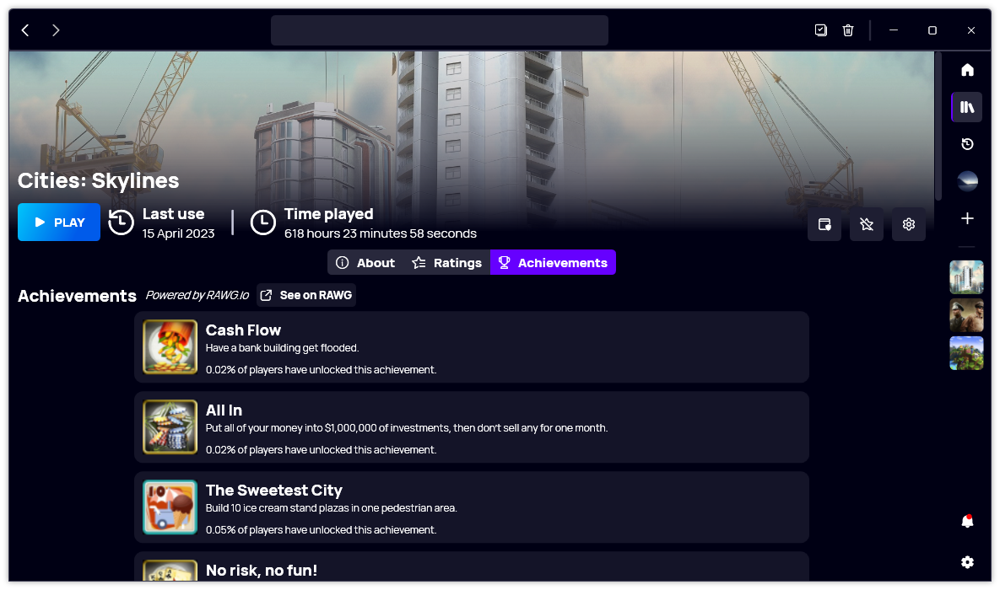

A new version of Gavilya is now available, and it is the version 3.4.0.2304.

## Changelog

### New

- Improved RAWG.io integration (#363)
- Added translations (#364)
- Added Sidebar position system (#364)
- Added the possibility to set the position of the sidebar (#364)
- Added a placeholder when there are no ratings (#365)

### Updated

- Updated PeyrSharp.Core (#357)
- Updated PeyrSharp.Env (#358)
- Updated RestSharp (#361)
- Updated MouseKeyHook (#362)

## Download

[Click here](https://bit.ly/Gavilya) to download Gavilya.

## Website

[Click here](https://gavilya.leocorporation.dev/) to go the website of Gavilya.

## Screenshot

