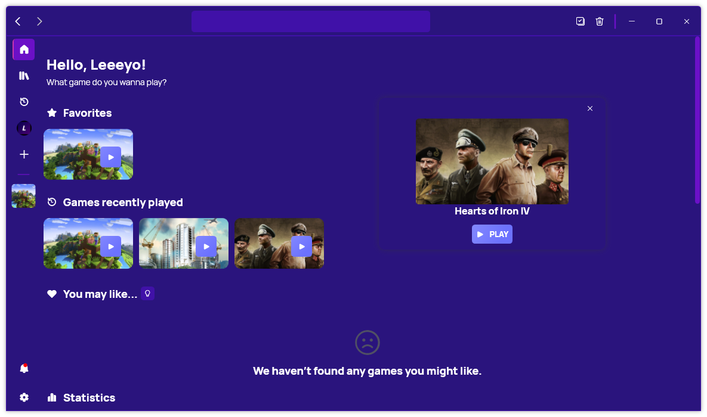
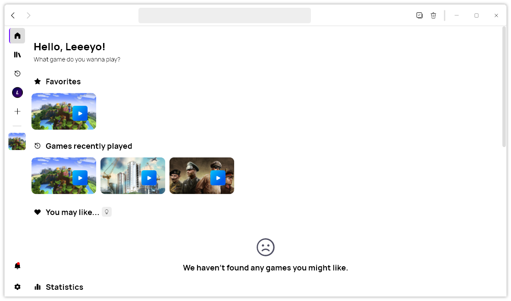

A new version of Gavilya is now available, and it is the version 3.5.0.2305.

## Changelog

### New

- Added basic theme file (#373)
- Added Background and Accent color (#374)
- Added Foreground theme color (#374)
- Added second background level (#374)
- Added second foreground theme (#374)
- Added Selected background theme (#374)
- Added Light foreground color (#374)
- Improved Play Button theme (#374)
- Added the theme system all across the app (#374)
- Added Theme information system (#375)
- Added translations
- Added the possibility to import a theme (#375)
- Added the possibility to set a default theme (#375)
- Added an animation when choosing a random game (#376)

### Fixed

- Fixed an issue with background color
- Fixed an issue with Linear gradients (#374)
- Fixed tooltip issue
- Fixed an issue with default theme

### Updated

- Updated PeyrSharp.Core (#371)
- Updated PeyrSharp.Env (#372)
- Updated default theme template

## Introducing Themes

Gavilya, the innovative game launcher that lets you organize and launch your games from one place, has just introduced a new feature that will make your gaming experience even more awesome: Themes!

Themes allow you to customize the appearance of Gavilya according to your preferences and style. You can import custom themes from other users or create your own!

To access the Themes feature, simply go to the Settings menu and click on Themes. There you will find a list of available themes that you can preview and apply. In the future, we also plan to release a theme store and editor on our website.

Themes are a great way to personalize your Gavilya experience and make it more fun and immersive. Whether you want to match your game launcher with your games, your personality, or your mood, Themes have got you covered. Try them out today and let us know what you think!

## Download

[Click here](https://bit.ly/Gavilya) to download Gavilya.

## Website

[Click here](https://gavilya.leocorporation.dev/) to go the website of Gavilya.
