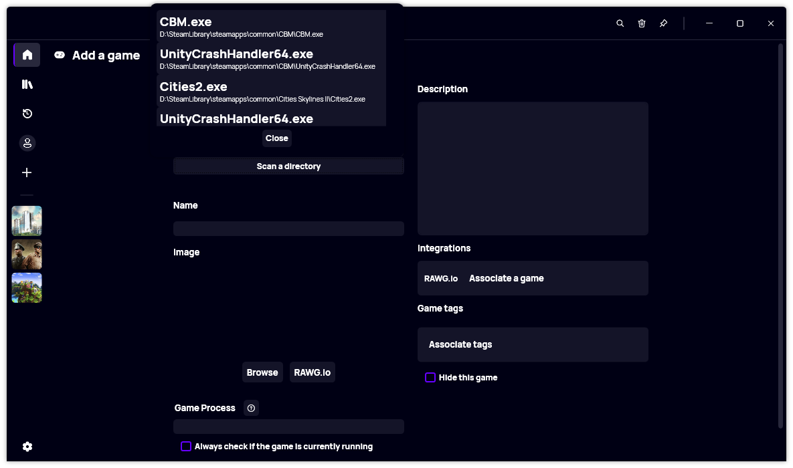
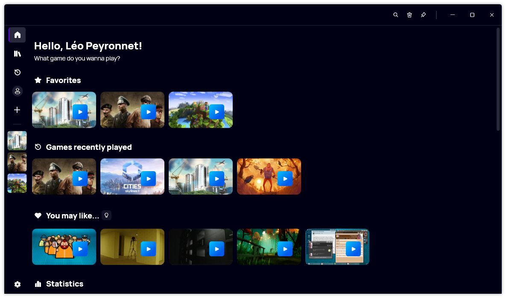
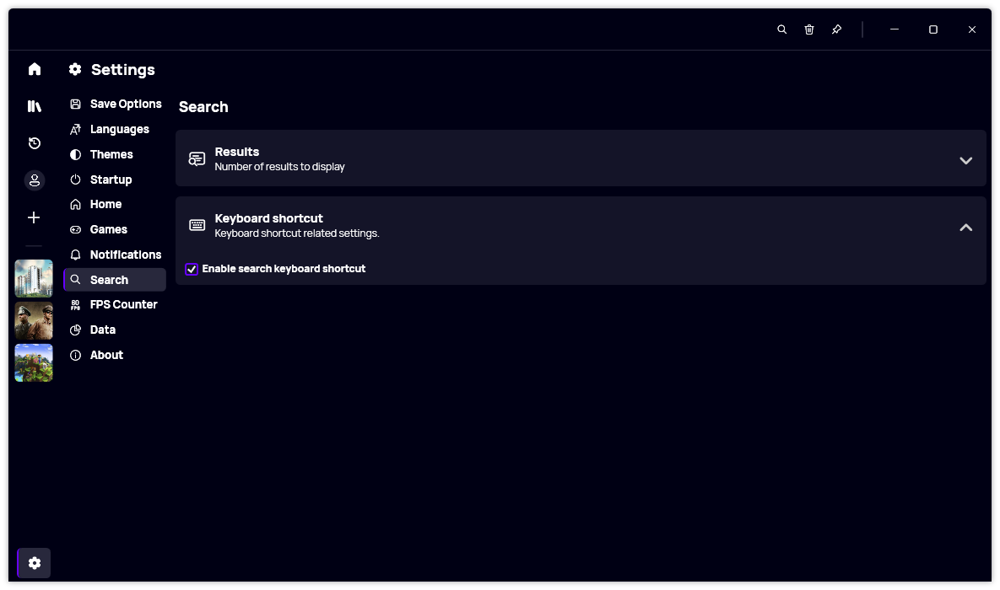

A new version of Gavilya is available and it brings several new features, such as the new Win32 game scanner and more.

## Game Scanner

When adding a Win32 game to Gavilya, you can now scan a particular directory to find all available executables inside of it and inside of its subdirectories. This can be particularly useful if you have a hard drive dedicated to games and don't know where are the games executables located.

## Random game

If you have a lot of games available in your library, it can sometimes be hard to make a choice. This why we also added back an old feature of Gavilya: Random game selection. In the home page, you will notice a new lightbulb icon next to the "You may like..." section. Clicking this icon will take you to a random game page. This feature can be useful if you really don't know which game you want to play.

## More customization options

Finally, we added new customization options and settings. You can now disable the search shortcut (Control+K) in the settings. Plus, it is now possible the pin the main window so it always stays on top of others.

## Changelog

### New

- Added translations (#426)
- Added the possibility to disable Search shortcut (#426)
- Added the possibility to get a random game (#427)
- Added tooltip text (#428)
- Added the possibility to pin the window (#428)
- Added Executable component (#429)
- Added Game scanner (#429)
- Added Scan button text (#429)
- Added the possibility to scan a directory for executables (#429)
- Added the possibility to close scan popup (#429)
- Added placeholder when no games are detected (#429)

### Updated

- Updated Microsoft.Xaml.Behaviors.Wpf (#425)

## Download

[Click here](https://bit.ly/Gavilya) to download Gavilya.

## Website

[Click here](https://gavilya.leocorporation.dev/) to go the website of Gavilya.
