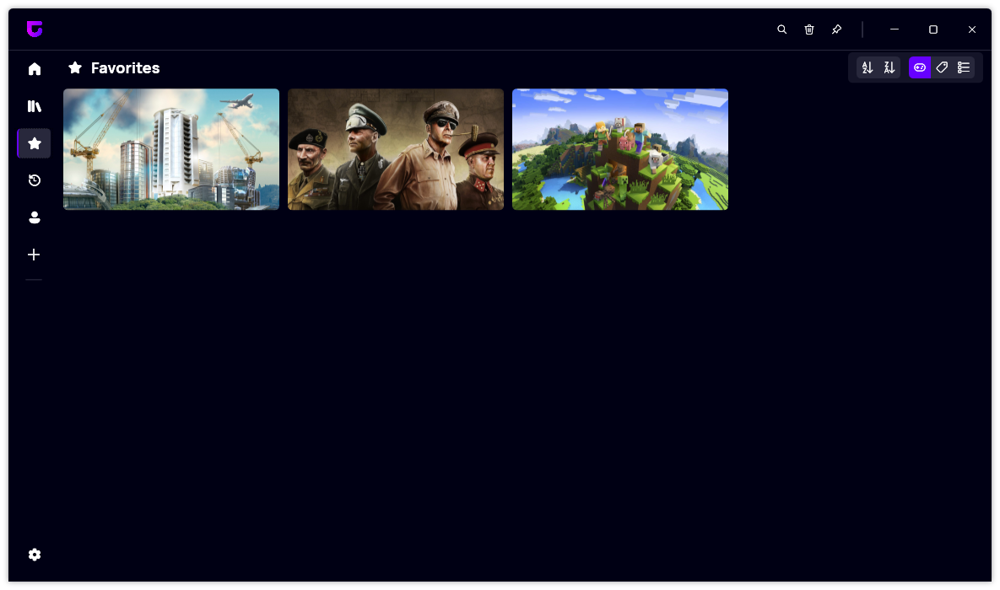

A new version of Gavilya is available and it brings sa new favorite page and several improvements to the app.
The features added in this version were brought by [@Bamboooz](https://github.com/Bamboooz).

## New favorite page

One of the most exciting features of this version of Gavilya is the new favorite page. This page shows you all the games that you have marked as favorites, so you can easily access them without browsing through your entire library. You can sort your games and even choose the view mode, just like the regular library page. The new favorite page is a great way to organize and enjoy your games with Gavilya.

## Changelog

### New

- Added Gavilya icon in the top left side of the app
- Adjusted settings button margin which was slightly off
- Steam games are now launched using `steam://rungameid/{game_id}` which launches the steam with it if it is not already opened,
  which means you don't have to have to open steam yourself.
- Added a separate favorites page
- Removed Favorite games tabfrom the library list view
- Added a "this week" tab to the recent page

### Fixed

- When hovering on games the text was `"Play to {game_name}"` instead of `"Play {game_name}"`
- Slight margin changes in the game card view
- Fixed many code style inconsistencies
- "What game do you wanna play" text in the home page replaced with "What game do you want to play"
- Fixed: Favorites page when set as startup page opened as home page
- Fixed: favorites page not updating each time you unfavorite a game
- Fixed missing navbar button highlight on Favorites page
- Fixed wrong french translations
- Fixed formal inconsistency in french translations

### Updated

- Changed the blue gradient in the displayed images when nothing is in the library/favorites page to a purple gradient to fit the applications style
- Changed the play button gradient from blue to purple, and in the home page display the play button only when hovering on game card, instead of it always being there

## Download

[Click here](https://bit.ly/Gavilya) to download Gavilya.

## Website

[Click here](https://gavilya.leocorporation.dev/) to go the website of Gavilya.
