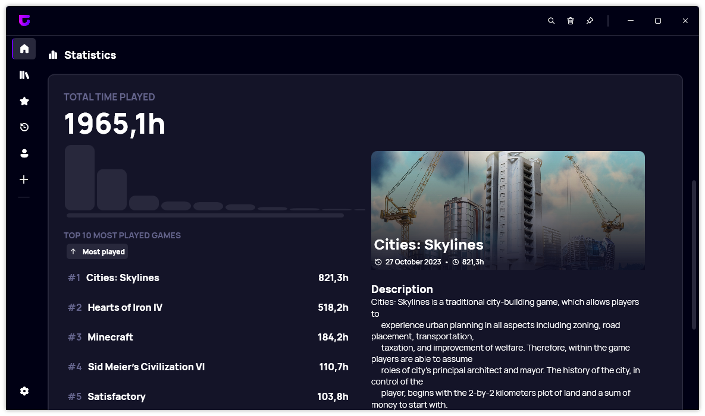

A new version of Gavilya is now available, and it is version 4.4.0.2403. This is also the first version of the year 2024, and we apologize for the lack of updates in recent months. This update doesn't include new major features, but rather focuses on improving existing areas of the app by introducing a more intuitive design.

We also want to bring to attention that starting with version 4.4.0.2403, Gavilya now relies on the [.NET 8 Desktop Runtime](https://dotnet.microsoft.com/en-us/download/dotnet/thank-you/runtime-desktop-8.0.2-windows-x64-installer), which is required to be installed on your system. If the runtime is not installed, after you update to v4.4.0.2403, Gavilya won't launch and will ask you to download it.

## Redesigned Statistics section

The statistics section of the dashboard has been redesigned slightly to be more clear and visible. We removed the quick info section and integrated it directly under the game name.

## Improved Game creation experience

The latest updates of Gavilya introduced a new way to add Win32 games by scanning a directory for executables. However, the UI was not really easy to understand and that is why we decided to redesign the entire UI for this feature, but also for the RAWG integrations and the UWP app selector as well.

## Changelog

### New

- Redesigned the Statistics section (#441)
- Added border to popups in "Add a game" (#442)
- Added new design for RAWG item
- Redesigned Scan Directory popup (#443)
- Added translations (#443)
- Redesigned Scan Apps popup (#443)
- Upgraded to .NET 8

### Fixed

- Fixed wrong file format in Setting (#440)

### Updated

- Updated copyright years (#444)
- Updated PeyrSharp.Core (#445)
- Updated PeyrSharp.Env (#446)

## Download

[Click here](https://bit.ly/Gavilya) to download Gavilya.

## Website

[Click here](https://gavilya.leocorporation.dev/) to go the website of Gavilya.
