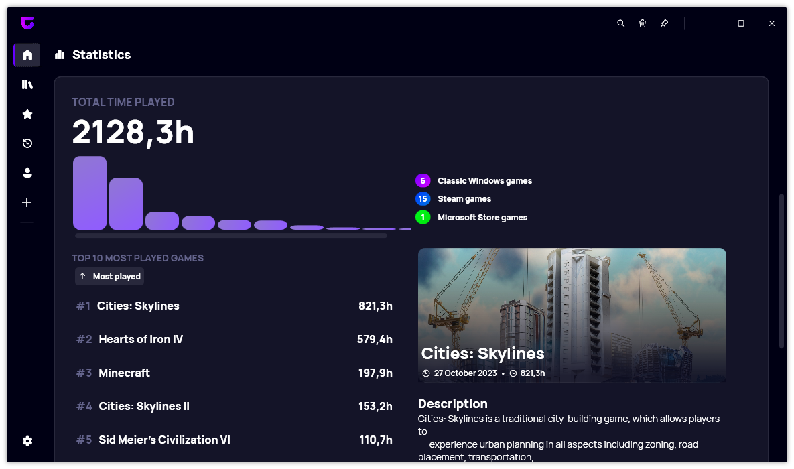
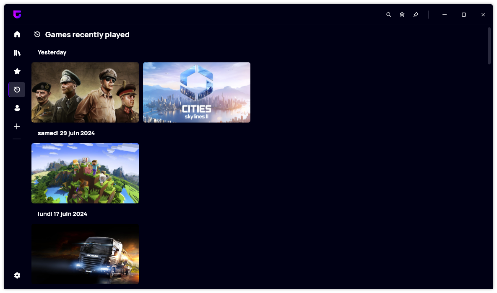

A new version of Gavilya is now available, and it is version 4.5.0.2407. We added several new features, such as the new Statistics section or the new sorting options in "Recently played games" page.

## New Statistics section

The latest update takes user experience to the next level by introducing a revamped Statistics section, packed with features that provide insightful, visually appealing data about your gaming habits.

Statistics are only as good as their presentation, and Gavilya understands this well. The addition of gradient designs in the Statistics section enhances the visual appeal, making your data more engaging and easier to interpret.

The update introduces a comprehensive Game Types Overview, giving users a snapshot of the types of games in their collection. You can now quicly see how many Windows, Steam or Xbox games you have added to Gavilya. In addition, in the Library page, you can now see the total number of games in your collection at a glance.

## New Sorting options

The latest update brings a fresh look to the Recently Played Games page, introducing new sorting options that offer gamers enhanced flexibility and control over their play history. These additions make it easier than ever to navigate your recent gaming sessions and keep track of your gameplay trends.

One of the standout features of the update is the ability to toggle the "Group by Date" option. This functionality allows you to organize your recently played games based on the date you last played them. With a simple toggle, you can switch between viewing your games in a continuous list or grouped by specific play dates.

You can also restore the old layout by disabling this feature in your settings.

## Changelog

### New

- Added new tooltip design (#453)
- Added new gradient in Stats (#454)
- Added translations (#454)
- Added Game types overview section in Stats (#454)
- Added the number of games in the library page (#455)
- Added a link to Gavilya Themes website (#456)
- Added new Group by date feature in Recent page (#457)
- Added translations (#457)
- Added the possibility to toggle Group by Date option in Recent page (#457)

### Updated

- Updated dependencies

## Download

[Click here](https://bit.ly/Gavilya) to download Gavilya.

## Website

[Click here](https://gavilya.leocorporation.dev/) to go the website of Gavilya.
