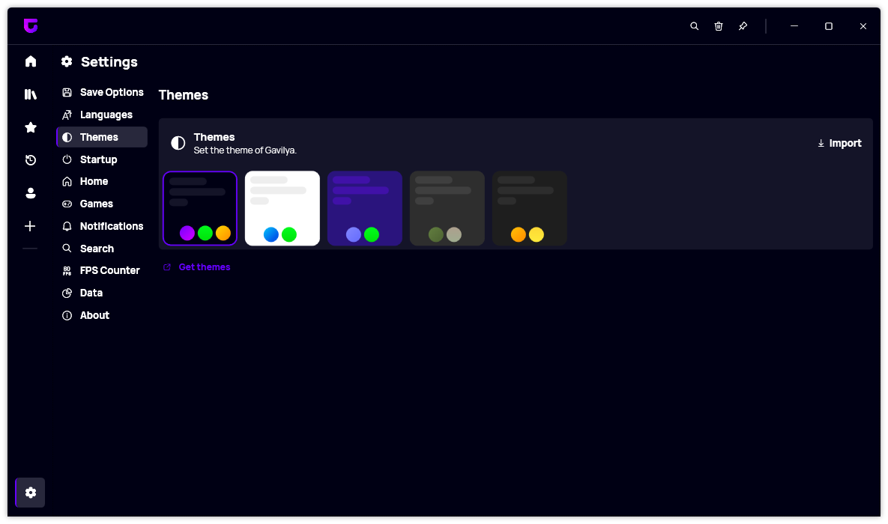
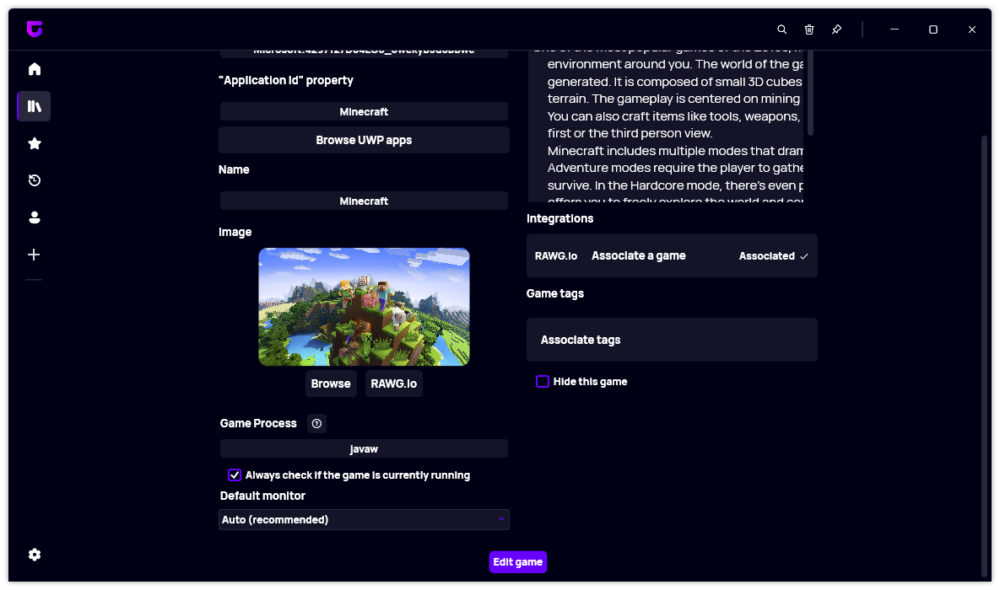
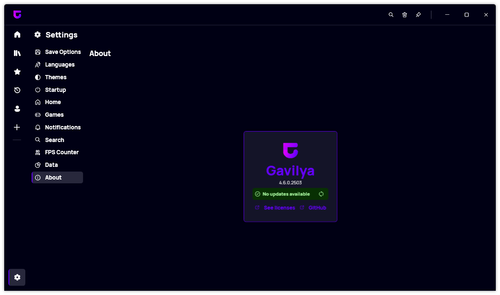

A new version of Gavilya is now available, and it is version 4.6.0.2503. We added several new features, such as the possibility to change the default monitor, a new theme section, and more.

## New Theme section

One of the standout features in this update is the addition of a new Theme section. This new section provides a comprehensive view of your available themes, allowing you to quickly assess their status and details.

Please note that you will need to update the themes to the latest version to use them with this new version of Gavilya. If you don't, you may experience issues with the app, especially with the new About section.

## Monitor Changer

The latest version of Gavilya introduces the possibility to change the default monitor. This feature gives you greater control over which monitor is used when launching a game, allowing you to select the best option for your setup.

## New About Section

We also added a new About section to the app, giving you quick access to information about Gavilya (update status, licenses, etc).

## Changelog

### New

-   Welcome message now uses profile name ([#474](https://github.com/Leo-Corporation/Gavilya/issues/474))
-   Added new ComboBox design ([#475](https://github.com/Leo-Corporation/Gavilya/issues/475))
-   Added new Theme resources ([#476](https://github.com/Leo-Corporation/Gavilya/issues/476))
-   Added new About page ([#476](https://github.com/Leo-Corporation/Gavilya/issues/476))
-   Added Theme Selector component ([#477](https://github.com/Leo-Corporation/Gavilya/issues/477))
-   Added new Theme selector UI ([#477](https://github.com/Leo-Corporation/Gavilya/issues/477))
-   Added locales ([#478](https://github.com/Leo-Corporation/Gavilya/issues/478))
-   Added new List syntax
-   Added the possibility to select a monitor ([#478](https://github.com/Leo-Corporation/Gavilya/issues/478))
-   Added Monitor Changer Helper ([#478](https://github.com/Leo-Corporation/Gavilya/issues/478))
-   Added the possibility to change monitor when launching a game ([#478](https://github.com/Leo-Corporation/Gavilya/issues/478))

### Updated

-   Updated licenses and copyright

## Download

[Click here](https://bit.ly/Gavilya) to download Gavilya.

## Website

[Click here](https://gavilya.leocorporation.dev/) to go the website of Gavilya.
