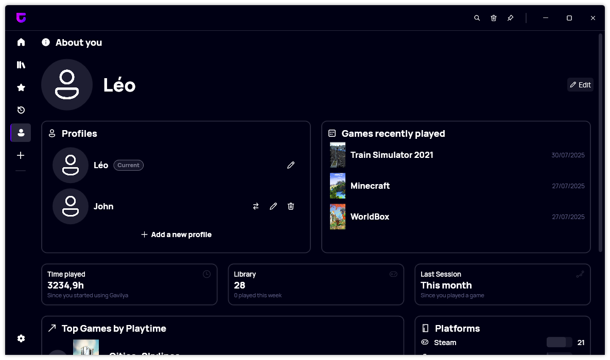
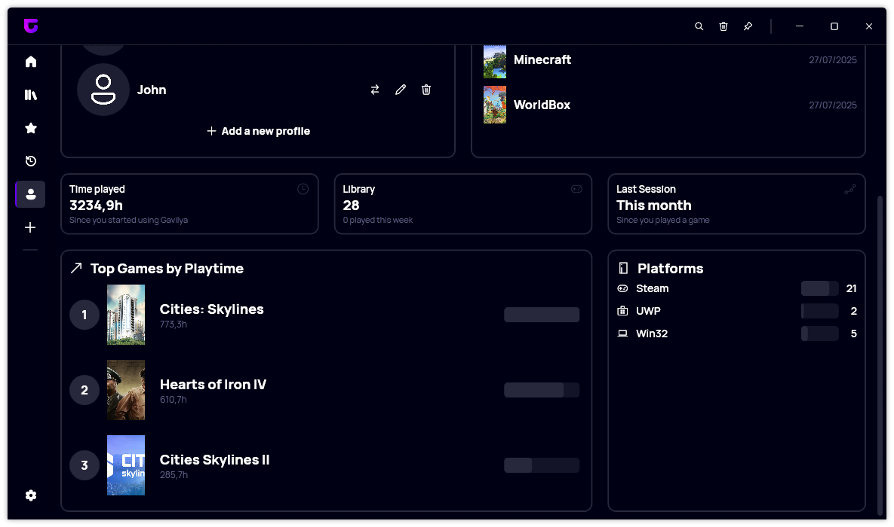
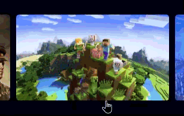

We are excited to announce the release of Gavilya version 4.7.0.2508, which includes a complete redesign of the Profile page and several new features to enhance your gaming experience.

## Redesigned Profile Page

The most significant change in this version is the complete redesign of the Profile page. The new layout provides a more organized and visually appealing way to view your gaming profile. It includes sections for Top Games, Recent Games, and Platforms, making it easier to track your gaming activities and achievements.

## New Features

In addition to the redesigned Profile page, we have introduced several new features:
- **Random Color for Tags**: When adding a tag, a random color is now generated to enhance visual differentiation.
- **Color Generation for Tags**: You can now generate a specific color for a tag, allowing for better customization and organization.
- **Animation on Game Card**: Game Cards now feature a subtle animation, enhancing the overall user experience.

## Changelog

### New
- A random color is used when adding a tag ([#484](https://github.com/Leo-Corporation/Gavilya/issues/484))
- Added the possibility to generate a color for a tag ([#484](https://github.com/Leo-Corporation/Gavilya/issues/484))
- Added locales ([#485](https://github.com/Leo-Corporation/Gavilya/issues/485))
- Added new Cards Header in Profile page ([#485](https://github.com/Leo-Corporation/Gavilya/issues/485))
- Added new Progress Bar style ([#485](https://github.com/Leo-Corporation/Gavilya/issues/485))
- Added Top Games section ([#485](https://github.com/Leo-Corporation/Gavilya/issues/485))
- Added Platforms section ([#485](https://github.com/Leo-Corporation/Gavilya/issues/485))
- Added placeholder if the profile is empty ([#485](https://github.com/Leo-Corporation/Gavilya/issues/485))
- Added Recent Games section ([#485](https://github.com/Leo-Corporation/Gavilya/issues/485))
- Added new profile page ([#485](https://github.com/Leo-Corporation/Gavilya/issues/485))
- Added animation on Game Card ([#486](https://github.com/Leo-Corporation/Gavilya/issues/486))

### Fixed
- Fixed an issue with tags serialization ([#483](https://github.com/Leo-Corporation/Gavilya/issues/483))

## Download

[Click here](https://bit.ly/Gavilya) to download Gavilya.

## Website

[Click here](https://gavilya.leocorporation.dev/) to go the website of Gavilya.
