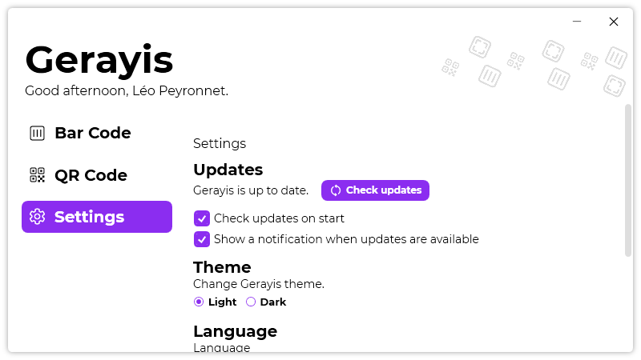
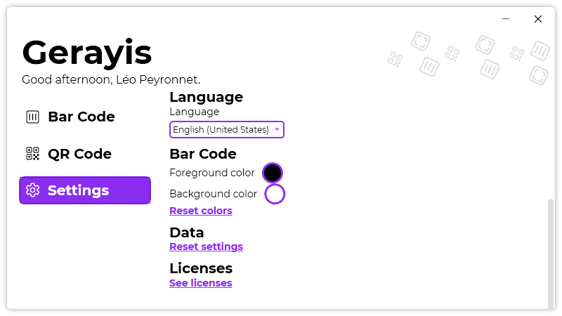
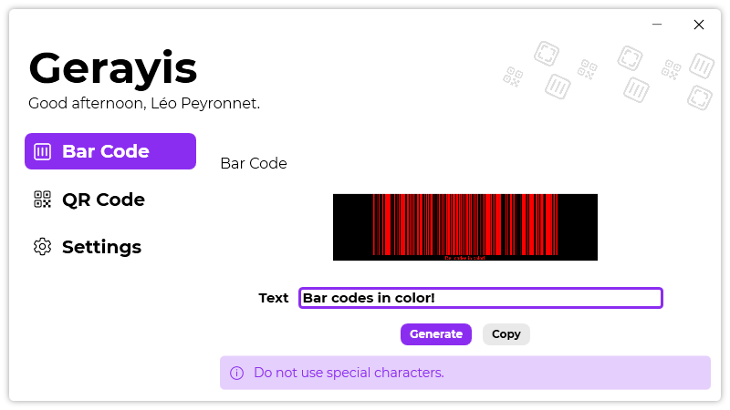

A new version of Gerayis is available, and it is the version 1.1.0.2104.

## Changelog
### New
- Added a notification when updates are available (#6)
- Added the possibility to set if Gerayis should check updates on start (#7)
- Added translations
- Added the possibility to reset settings (#8)
- Added the possibility to change the bar code color (#10)
### Fixed
- Fixed: Gerayis shows error if there is not internet (#5)
- Fixed text issues- Updated LeoCorpLibrary

## Download

[Click here](https://DownloadGerayis) to download Gerayis.

## Screenshots

