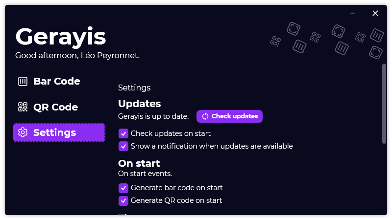

A new version of Gerayis is available, and it is the version 1.2.0.2105. Note that this version focuses on fixes, but still introduces small new features.

## Changelog
### New
- Aligned Bar code colors in the "Settings" page (#15)
- Added the possibility to generate a bar code on start (#16)
- Added the possibility to generate a QR code on start (#17)
### Fixed
- Fixed an issue when clearing colors, the language ComboBox is bugged (#13)
- Fixed: Mention of Passliss in "Reset settings message" (#14)
- Fixed an issue with the "Reset settings" link
### Updated
- Updated LeoCorpLibrary

## Download

[Click here](https://www.mediafire.com/file/tn32k3ff6zdvqs4/GerayisSetup.exe/file) to download Gerayis.

## Screenshot
