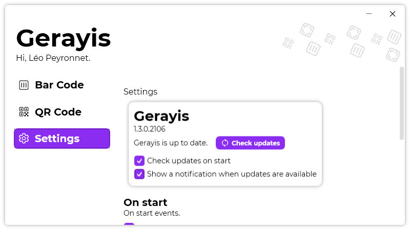

A new version of Gerayis is now available, and it is the version 1.3.0.2106.

## Changelog
### New
- Redesigned "About" section in settings (#21)
- Added translations- Added the possibility to export settings (#22)
- Added the possibility to import settings (#22)
- Added the possibility to save a generated bar code (#23)
- Added the possibility to save a generated QR code (#24)
- Added "hand" cursor to bar code color in settings (#25)
### Fixed
- Fixed an issue with light theme
### Updated
- Updated LeoCorpLibrary
- Updated BarcodeLib
- Updated Setup

## Download

[Click here](https://tinyurl.com/DownloadGerayis) to download Gerayis.

## Screenshot

