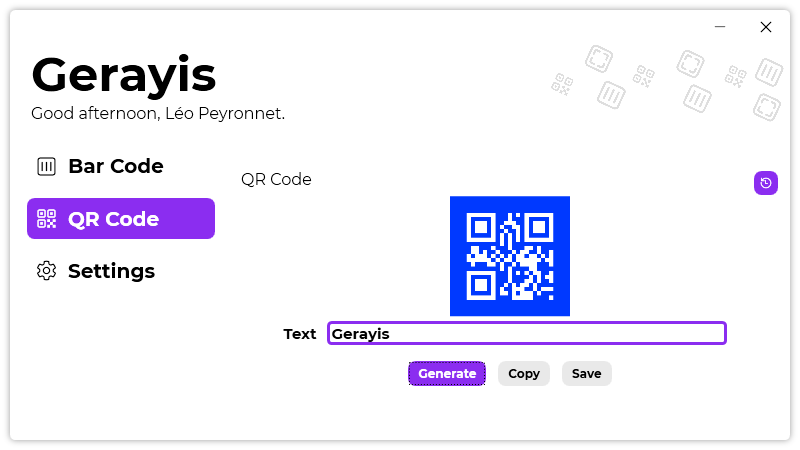
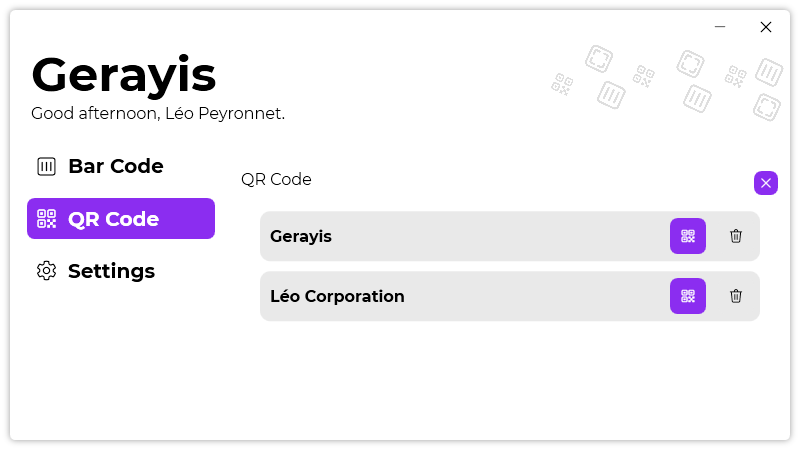
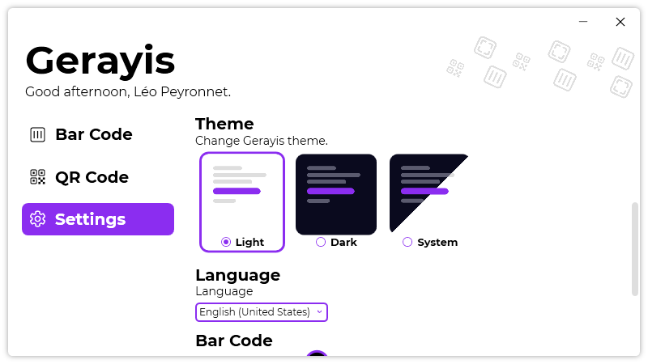

A new version of Gerayis is available, and it is the version 1.4.0.2107.

## Changelog
### New
- Added translations
- Added the possibility to set the theme to system (#33)
- Added theme assets (#34)
- Redesigned the theme picking UI (#34)
- Added an history of generated bar codes (#35)
- Added an history of generated QR codes (#35)
- Added the possibility to set a QR code's colors (#36)- Updated LeoCorpLibrary
### Fixed
- The history item's icon is different if it is used in the QR Code history (#35)

## Download

[Click here](https://tinyurl.com/DownloadGerayis) to download Gerayis.

## Screenshot

