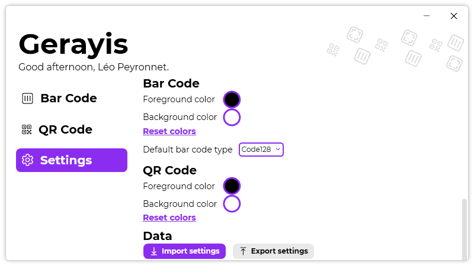

A new version of Gerayis is now available, and it is the version 1.6.0.2109.

## Changelog
### New
- Added translations
- Added the possibility to set a bar code type by default (#57)
- Added default text depending on the bar code type (#58)
### Updated
- Improved "Settings" page bottom margin
- Removed duplicates in Bar code history (#59)
- Removed duplicates in QR code history (#59)
- Made default theme "System" (#60)
- Updated LeoCorpLibrary

## Download

[Click here](https://tinyurl.com/DownloadGerayis) to download Gerayis.

## Screenshot

