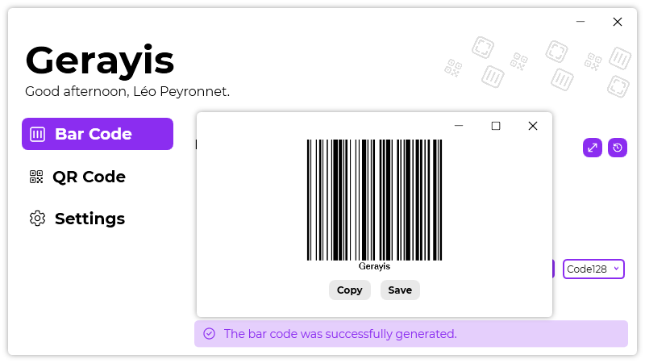

A new version of Gerayis is now available and it is the version 1.8.0.2111.

## Changelog
### New
- Added the possibility to copy a bar code when clicking on it (#76)
- Added the type of bar code column in history (#77)
- Added new translations (#78)
- Added tooltips on "History" buttons (#78)
- Added the possibility to view a bar code in a separated window (#79)
- Added the possibility to maximize the "See full bar code" window (#79)
- Added the possibility to resize the "See full bar code" window (#79)
- Redesigned links in "Settings" page (#80)
### Fixed
- Fixed resizing issues
### Updated
- Updated LeoCorpLibrary

## Download

[Click here]() to download Gerayis.

## Screenshot
