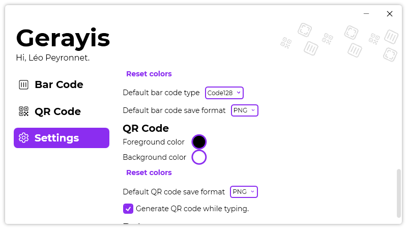

A new version of Gerayis is now available, and it is the version 1.9.0.2112.

## Changelog
### New
- When saving a bar code, the default file name is the string used to generate it (#89)
- When saving a QR code, the default file name is the string used to generate it (#89)
- Added the possibility to save a bar code as a JPEG image (#90)
- Added the possibility to save a QR code as a JPEG image (#91)
- Added translations
- Added the possibility to set a default file type when saving a bar code (#92)
- Added the possibility to set a default file type when saving a QR code (#92)
### Fixed
- Fixed: The "Show bar code" window overflows the taskbar when it's maximized (#88)
- Fixed an issue with System theme not working on Windows 11
### Updated
- Updated LeoCorpLibrary
- Updated QRCoder

## Download

[Click here](https://tinyurl.com/DownloadGerayis) to download Gerayis.

## Screenshot
