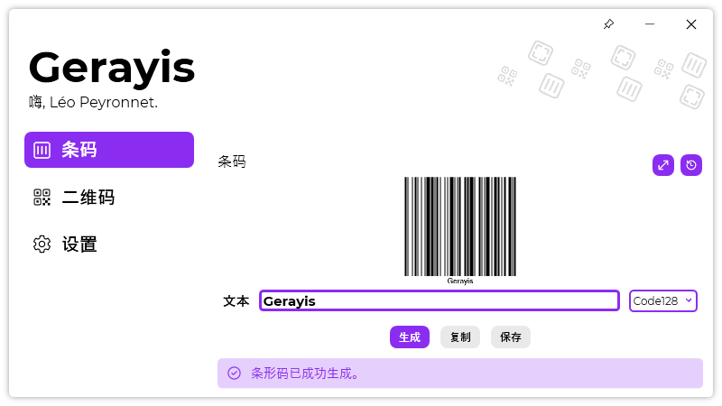

A new version of Gerayis is now available, and it is the version 1.9.1.2201. Note that this version doesn’t include huge new features, but improvements, fixes, and new translations.

## Changelog
### New
- Added Simplified Chinese language (#100 - Thanks to @wcxu21)
- Added translations (#102)
- Added the possibility to pin the window (#102)
### Updated
- Updated LeoCorpLibrary
- Updated copyright year(s) (#101)

## Download

[Click here](https://tinyurl.com/DownloadGerayis) to download Gerayis.

## Screenshot
