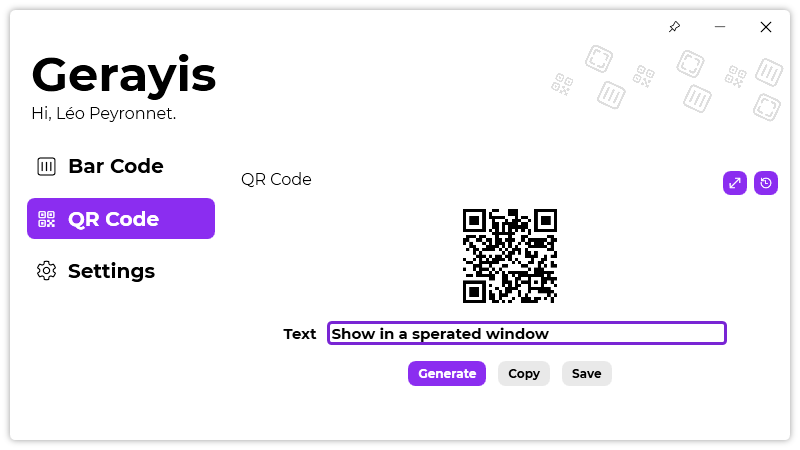

A new version of Gerayis is now available, and it bis the version 2.1.0.2204.

## Changelog
### New
- Added the possibility to view a QR code in a separated window (#118)
- Added translations (#118)
- Added "Generate bar code" jump list (#119)
- Added "Generate a QR code" jump list (#119)
- Added logic code for taskbar jump lists (#119)
- Added MouseKeyHook NuGet package (#120)
- Added keyboard shortcuts in "Bar code" page (#120)
- Added keyboard shortcuts in "QR Code" page (#120)
- Added keyboard shortcuts (#120)
- Added "Credits" window (#121)
### Fixed
- The title of the "See bar code" window changes depending on the parent page (#118)
- Fixed an issue where bar codes were copied even if the window was minimized
### Updated
- Updated LeoCorpLibrary
- Updated "SeeFullQrCode" tooltip (#118)

## Download

[Click here](https://tinyurl.com/DownloadGerayis) to download Gerayis.

## Screenshot

