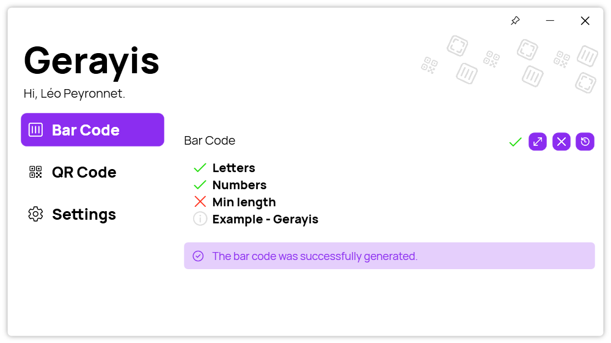

A new version of Gerayis is now available, and it is the version 2.2.0.2207.

## Changelog
### New
- Added "Info" panel (#137)
- Added translations (#137)
- Added an "Info" section about each bar code type (#137)
- Added colors on icons in "Info" panel (#137)
- Added margins to "Info" panel (#137)
- Added more info about min length in "Info" panel (#137)
- Added an example in "Info" panel (#137)
- Added OpenSource mention (#138)
- Added an icon TextBlock (#139)
- Added an Indicator that shows if a bar code can be generated (#139)
- Added font files (#140)

### Fixed
- Fixed missing label in "Info" panel

### Updated
- Updated LeoCorpLibrary
- Improved design of "Info" panel (#137)
- Updated font (#140)

## Download

[Click here](http://tinyurl.com/DownloadGerayis) to download Gerayis.

## Screenshot
