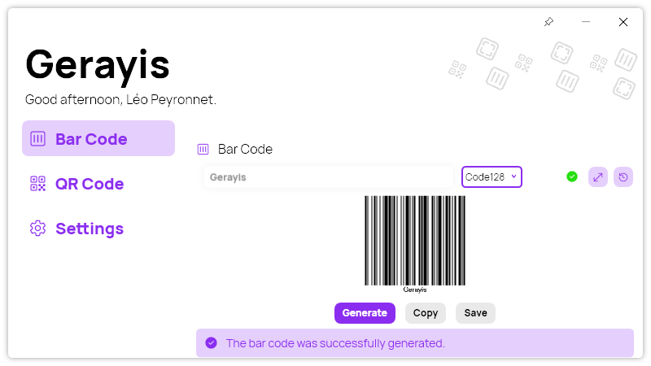

A new version of Gerayis is now available, and it is the version 2.5.0.2304.

## Changelog

### New

- Added the possibility to see the bar/QR code in full screen from history (#174)
- Added translations (#175)
- Added the possibility to clear the history data (#175)
- Modernized navbar (#176)
- Merged status icon and info button (#176)
- Modernized the UI (#176)
- Added new titles (#176)

### Fixed

- Fixed punctuation

### Updated

- Updated PeyrSharp (#172)
- Updated MouseKeyHook (#173)

## Download

[Click here](http://tinyurl.com/DownloadGerayis) to download Gerayis.

## Screenshot

