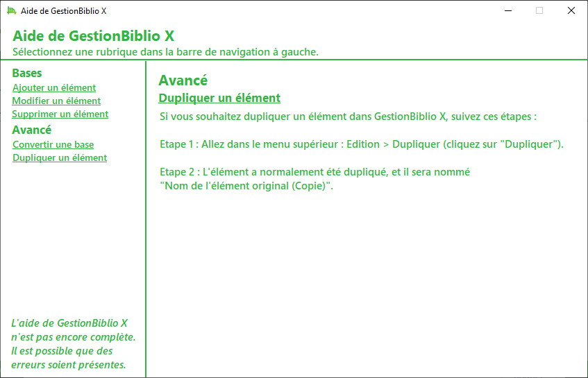

A new version of GestionBiblio X, Basic edition is now available and it's the version 1.6.2.2101.

## Changelog
### New
- Added the "Duplicate Item" help page
### Fixed
- Fixed typos in the "Help" window
### Updated
- Updated the copyright notice in the "About" window

## Download
[Click here](http://bit.ly/GestionBiblioX) to download GestionBiblio X, Basic Edition (only in french)

## Screenshot

