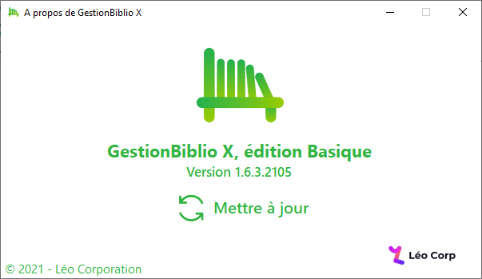

 A new version of GestionBiblio X Basic is now available and it is the version 1.6.3.2105.

## Changelog
### New
-	Added a new look for the “About” window
### Updated
-	Updated support and website links to https://leocorporation.dev
-	Updated logo

## Download

[Click here](http://bit.ly/GestionBiblioX) to download GestionBiblio X Basic.

## Screenshot

