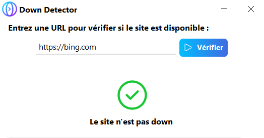

A new version of InternetTest 4 is available and it's the version 4.10.0.2101.

## Changelog
### New
- Added a "Down Detector" (#165)
- Added dark theme to the Down Detector (#165)
- Added translations to the "Down Detector" window (#165)
- Added a link to the "Down Detector" window (#165)
- Added an autofil in the "Down Detector" window (#165)
### Fixed
- Fixed an issue with the auto-completing system
### Updated
- Updated LeoCorpLibrary
- Updated Copyright (#166)

## Download
[Click here](https://tinyurl.com/DownloadInternetTest) to download InternetTest 4.

## Screenshot
