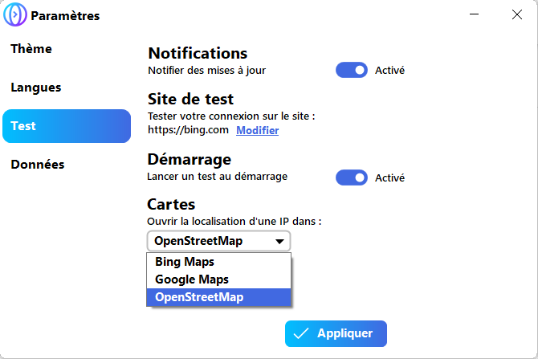

A new version of InternetTest is now available and it's the version 4.11.0.2102.

## Changelog
### New
- Added a placeholder in the "Down Detector" window (#171)
- Added the "OpenStreetMap" map provider (#172)
- Changed the default map provider (#172)
### Fixed
- Fixed: Missing shadow in Down Detector window (#170)
### Updated
- Updated LeoCorpLibrary
- Updated Setup

## Notes
Starting with version 4.11.0.2102, the default map provider will be "OpenStreetMap" instead of "Bing Maps".

## Download
[Click here](https://tinyurl.com/DownloadInternetTest) to download InternetTest 4.

## Screenshot

