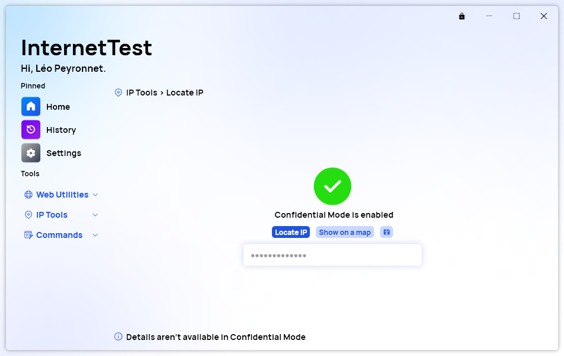

A new version of InternetTest Pro is now available and brings several new features, while fixing some other issues.

## Changelog
### New
- Added the possibility to remember the window state (#367)
- Added "Confidential Mode" button (#368)
- Added translations (#368)
- Added Confidential Mode in "My IP" page (#368)
- Added Confidential Mode in "Locate IP" page (#368)
- Added Confidential Mode in "IP Config" page (#368)
- Added Confidential Mode in "WiFi Passwords" page (#368)
- Added new resource strings (#369)
- Added description text for authentication in WiFi Passwords (#369)

### Fixed
- Fixed "Unknown host" error (#366)
- "My IP" details are now hidden when Confidential Mode is enabled (#368)
- Fixed missing font issues

## Confidential Mode
The Confidential Mode is a new feature of InternetTest which aims to protect the privacy and sensitive information of our users.
It can be toggled from anywhere in the app; by clicking the button in the title bar. Once it is enabled, IP addresses (and their details), WiFi networks SSIDs, and some IP Config information will be hidden. You can still retrieve these information by disabling Confidential Mode.

## Download

[Click here](tinyurl.com/DownloadITP7) to download InternetTest.

## Screenshot
