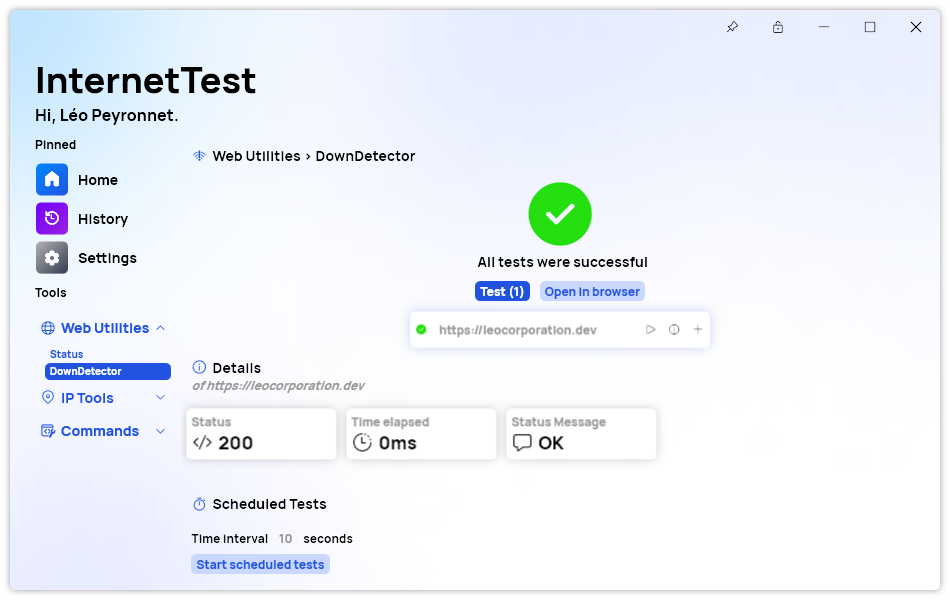

A new version of InternetTest Pro is now available and brings several new features, while fixing some other issues.

## Changelog
### New
- Added the possibility to pin the window (#375)
- Added a "Status" header in the Dashboard page (#376)
- Added new theme resources (#377)
- Added translations (#377)
- Added an overview of all tests in DownDetector page (#377)

### Updated
- Replaced LeoCorpLibrary with PeyrSharp (#378)

## Download

[Click here](tinyurl.com/DownloadITP7) to download InternetTest.

## Screenshot
