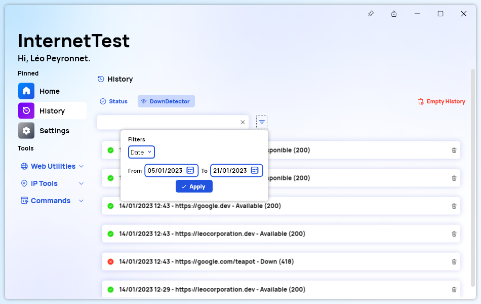

A new version of InternetTest Pro is now available and brings new features and improvements.

## Changelog
### New
- Added a new history system that works across languages (#390)
- Added copyright to Setup
- Added Italian language (#394) 
- Added Italian in Setup (#394)
- Added the possibility to search the History (#391)
- Added translations (#392)
- Added "Filters" Popup (#392)
- Added the possibility to filter dates through the history (#392)
- Added an error message if the date range is invalid (#392)
- Added copyright to Setup
- Added Italian language (#394) 
- Added Italian in Setup (#394)
- Added the possibility to search the History (#391)
- Added translations (#392)
- Added "Filters" Popup (#392)
- Added the possibility to filter dates through the history (#392)
- Added an error message if the date range is invalid (#392)

### Fixed
- Fixed an issue when loading the old history (#390)
- Fixed an issue with display name in Setup

### Updated
- Updated PeyrSharp.Env (#388)
- Updated PeyrSharp.Core (#389)
- Updated copyright
- Improved Setup 

## Download

[Click here](tinyurl.com/DownloadITP7) to download InternetTest.

## Screenshot
