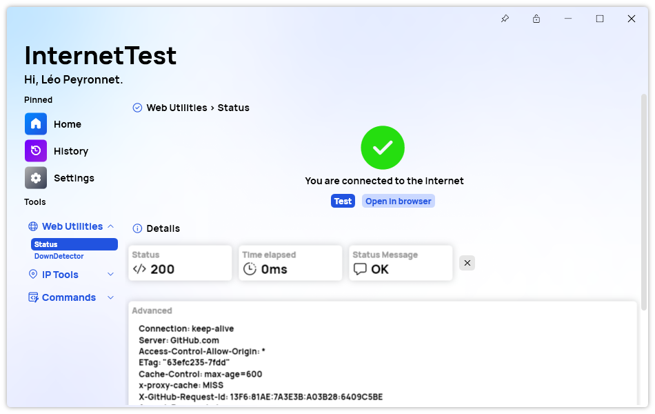

A new version of InternetTest Pro is now available and brings new features and improvements.

## Changelog
### New
- Added translations (#403)
- Added the possibility to filter history by state (#403)
- Added the possibility to copy the details in DownDetector (#404)
- Added the possibility to copy the details in Locate IP (#404)
- Added the possibility to copy the details in My IP (#404)
- Added the possibility to copy the details in Ping (#404)
- Added the possibility to copy the details in Status (#404)
- Added the possibility to enable confidential mode by default (#405)
- Added translations (#406)
- Added the possibility to get the "technical" information of request (#406)
- Added the possibility to remember the "pin" state (#407)

### Updated
- Updated PeyrSharp.Core (#401)
- Updated PeyrSharp.Env (#402)

## Download

[Click here](tinyurl.com/DownloadITP7) to download InternetTest.

## Screenshot
