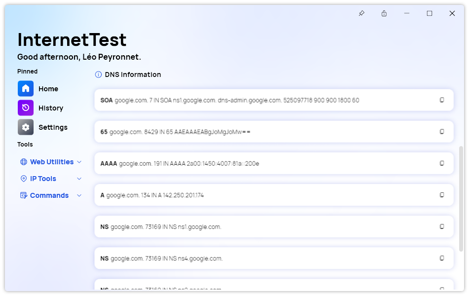
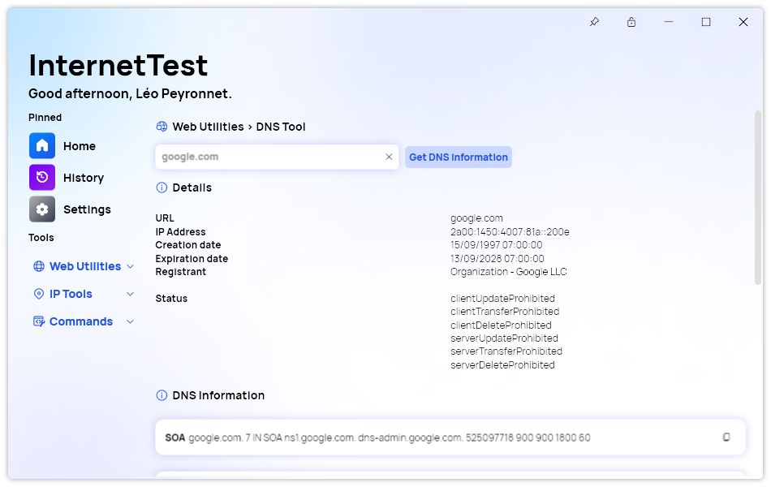

A new version of InternetTest Pro is now available and brings new features and improvements.

## Changelog

### New

- Added translations (#416)
- Added DNS page in Synethia (#416)
- Added the possibility to get the IP of the host (#417)
- Added translations (#418)
- Added the DNS record item (#418)
- Added the possibility to get the DNS records of the domain name (#418)
- Added the possibility to get the WHOIS of a domain (#419)
- Added code to avoid errors
- Fixed an issue when looking for multiple websites (#418)

### Fixed

- Fixed an issue with SynethiaManager (#416)
- Fixed an issue with the Action Card

### Updated

- Updated PeyrSharp.Env (#414)
- Updated PeyrSharp.Core (#415)
- Improved consistency

## DNS Tool

### Overview

If you are a web developer or a network administrator, you know how important it is to test the performance and security of your websites and servers. That's why you need InternetTest Pro, the ultimate tool for internet testing and troubleshooting.

But InternetTest Pro is not just a testing tool. It also helps you to improve your websites and servers with its new DNS Tool feature, introduced in version 7.5. The DNS Tool feature allows you to:

- Get the IP from a domain name
- Get information about the WHOIS of the domain
- Get the DNS records

Let's see how these features work and how they can help you.

### Get the IP from a domain name

Sometimes you need to know the IP address of a website or a server, for example, to check if it is online or to bypass a firewall. With InternetTest Pro, you can easily get the IP from any domain name with just one click.

To do this, simply enter the domain name in the DNS Tool field and click on the "Get DNS Information" button. InternetTest Pro will show you the IP address of the domain name.

### Get information about the WHOIS of the domain

Another useful feature of InternetTest Pro is the ability to get information about the WHOIS of any domain name. The WHOIS is a database that contains information about the owner and registrar of a domain name, such as their name, address, phone number, email, and expiration date.

This information can help you to identify the owner of a domain name, to contact them in case of any issues or disputes, or to check if a domain name is available for registration.

To get information about the WHOIS of a domain name, enter the domain name in the DNS Tool field and click on the "Get DNS Information" button. InternetTest Pro will show you the most important information available in the WHOIS database for that domain name.

### Get the DNS records

The DNS records are the settings that control how a domain name is resolved to an IP address and how it interacts with other services on the internet. For example, the A record specifies the IP address of a domain name, the MX record specifies the mail server of a domain name, and the TXT record specifies various verification and configuration data.

The DNS records are essential for ensuring that your websites and servers work properly and securely. With InternetTest Pro, you can easily get the DNS records of any domain name with just one click.

To do this, enter the domain name in the DNS Tool field and click on the "Get DNS Information" button. InternetTest Pro will show you all the DNS records of that domain name, such as A, AAAA, CNAME, MX, NS, SOA, SRV, and TXT.

### Conclusion

As you can see, InternetTest Pro is more than just a testing tool. It also helps you to improve your websites and servers with its new DNS Tool feature. With this feature, you can easily get the IP from a domain name, get information about the WHOIS of the domain name, and get the DNS records of any domain name.

If you want to try out this feature yourself, download InternetTest Pro today. You will be amazed by how much InternetTest Pro can do for you.

## Download

[Click here](tinyurl.com/DownloadITP7) to download InternetTest.

## Screenshot

